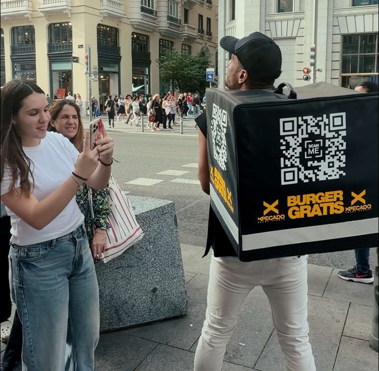

En el actual panorama de la publicidad exterior, captar la atención del consumidor e impactar en su memoria no es siempre una tarea fácil.

Las personas transitan a gran velocidad, conectadas a sus teléfonos y cada vez más inmunes a los impactos estáticos tradicionales en las vías públicas. Por ello, para conectar de manera genuina y sorprendente, las marcas deben evolucionar y ofrecer algo más que un producto o un buen diseño: deben generar momentos inolvidables.

Precisamente bajo esta premisa desarrollamos nuestra última **acción especial de street marketing en las calles de Madrid**, diseñada para sorprender, interactuar y conectar de forma directa con nuestro público.

## El animador que escondía una gran sorpresa

<iframe
  class="float-left mt-1 mr-8"
  width="270"
  height="480"
  src="https://www.youtube.com/embed/W2ZaN1U_Wts"
  title="YouTube video player"
  frameBorder="0"
  allow="accelerometer; autoplay; clipboard-write; encrypted-media; gyroscope; picture-in-picture; web-share"
  allowFullScreen
></iframe>

Para estructurar la campaña, decidimos apostar por un elemento cotidiano que está totalmente integrado en el entorno urbano: el servicio de comida a domicilio o delivery.

Para llevarlo a cabo, contamos con la destreza de un extrovertido animador que transitaba la ciudad, equipado y caracterizado perfectamente como un repartidor habitual.

Sin embargo, su enorme mochila tradicional no transportaba envíos convencionales, sino que era el medio de nuestra activación.

En los laterales de esta mochila, de forma muy visible, se integró un código QR de gran tamaño. La premisa era directa, clara y tentadora: la posibilidad de conseguir una deliciosa **hamburguesa xPecado completamente gratuita** a todos aquellos que se animaran a escanearlo.

Una excelente y deliciosa oportunidad, muy difícil de dejar pasar para muchas personas.

## El incalculable valor de la interacción humana

Pese a que la tecnología a través del escaneo ofrece accesibilidad instantánea en los dispositivos móviles, la esencia original de la dinámica iba mucho más allá del simple acceso al premio.

Sabíamos que, para que esta publicidad no pasara desapercibida, el factor relacional y de contacto humano resultaba el punto de inflexión.

Por este motivo, el animador no se dedicaba simplemente a llevar el código móvil de un lado a otro. Al contrario, este interactuaba decididamente con los jóvenes, familias y viandantes madrileños presentes.

Se aproximaba de forma proactiva proponiendo pequeños retos y generando una serie de divertidas situaciones sumamente dinámicas con los grupos.

Estas sorpresas convirtieron cada encuentro en una experiencia increíblemente lúdica y participativa en la acera.

📲 El proceso resultaba increíblemente sencillo pero altamente participativo: **interacción, escaneo y recompensa**.

### Los resultados: Convertir la marca en pura experiencia

Desarrollar y poner en marcha esta llamativa acción nos dejó resultados muy positivos en un sector tan competido como el ocio, demostrando los beneficios de apostar por activar directamente al espectador.

Esta iniciativa nos permitió con gran éxito:

- **Generar _engagement_ real en el entorno urbano:** Consiguiendo que la gente dejara a un lado su rutina, captando inmediatamente su atención e invitándolos a jugar libremente.;
- **Aumentar la visibilidad de la marca de forma totalmente orgánica:** Ya que las interacciones conseguían atraer aún a más y más curiosos, sirviendo como una atracción excelente y generando mucho boca a boca en plena calle.
- **Crear una experiencia memorable asociada directamente a la marca:** Reforzando un recuerdo amable, alegre y divertido para los viandantes que obtuvieron algo más que las hambuerguesas de xPecado.

El número de personas que participaron en la acción y que probaron las hamburguesas de xPecado fueron un excelente cierre.

Una vez más volvimos a comprobar que **cuando una marca se acerca al público interactuando con él, la comunicación deja de ser un mensaje y se convierte en una experiencia**.
