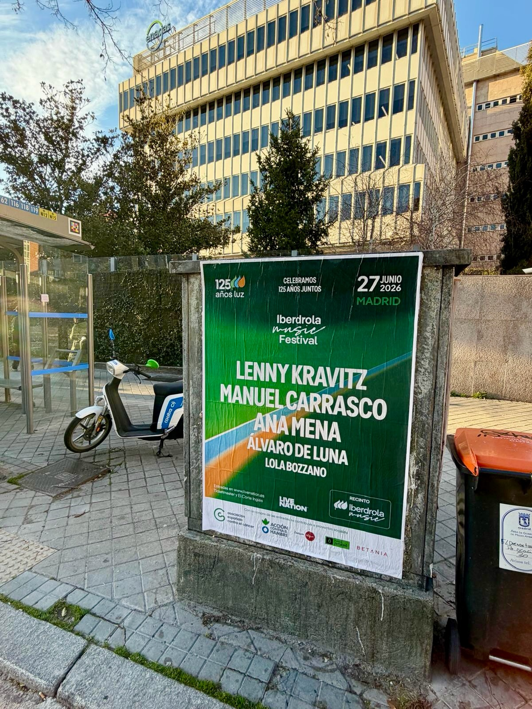

Cuando una marca celebra 125 años, hay motivos para hacer ruido. Iberdrola lo hace con música en directo y nosotros hemos puesto la calle a su servicio con una **pegada de carteles** en Madrid. El evento es *"Iberdrola Music Festival"*, que llega al Recinto Iberdrola Music el 27 de junio de 2026, y el trabajo consistió en llevar el anuncio a un soporte urbano que no se puede ignorar.

## Un cartel en el exterior de una marquesina

El soporte elegido fue el exterior de una marquesina, pegada a una parada de autobús. Es un punto de paso real: gente que espera, gente que camina, gente que va en bici o en moto. El cartel ocupa todo el panel y se ve desde lejos, con el fondo verde como seña de identidad y el mensaje de los 125 años luz en grande.

En el diseño no falta detalle: la fecha, la ciudad, el nombre del recinto, las webs de venta de entradas (livenation.es, Ticketmaster y El Corte Inglés) y el sello de la promotora Live Nation, junto a otras entidades que colaboran en el evento.

## Los artistas que aparecen en el cartel

El cartel del festival es de esos que llaman la atención aunque no sigas la música en directo. Estos son los nombres que aparecen en el póster:

- Lenny Kravitz
- Manuel Carrasco
- Ana Mena
- Álvaro de Luna
- Lola Bozzano

Cinco artistas, cinco estilos y una noche entera de directo para celebrar el aniversario de la compañía en Madrid.

## Por qué la pegada de carteles sigue funcionando

Hacer **street marketing** no es solo colocar un anuncio y marcharse. La pegada de carteles sigue dando resultados porque:

1. Está en la calle, donde está la gente.
2. Genera recuerdo: el cartel se ve varias veces al día.
3. Da credibilidad a un evento grande, porque ocupa un espacio físico real.
4. Funciona como recordatorio de la fecha y de dónde comprar las entradas.

En este caso, el trabajo se hizo con un soporte bien elegido y un mensaje claro. Si tienes un concierto, un festival o un lanzamiento y quieres que la ciudad se entere, este tipo de acción sigue siendo una de las formas más directas de conseguirlo.
