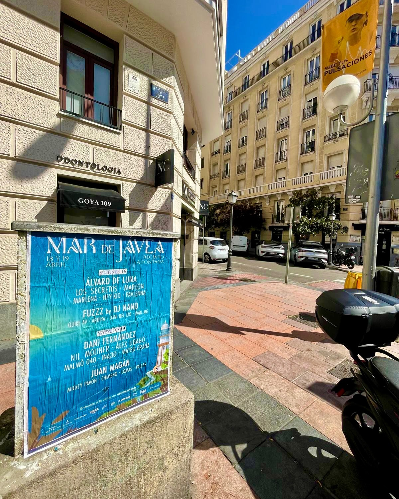

Si hay un cartel que suena fuerte en Jávea, ese es el del *"Festival Mar de Jávea"*. Los días 18 y 19 de abril, el Recinto La Fontana se llena de música con artistas como Álvaro de Luna, DJ Nano, Dani Fernández, Juan Magan, Alex Ubago, Los Secretos, Marlena y Nil Moliner. Nosotros nos encargamos de que ese cartel llegara a la calle de la mejor manera posible: con una buena **pegada de carteles**.

## Una campaña de **street marketing** que se ve y se siente

La pegada de carteles no es solo pegar papel. Es elegir el sitio, el momento y la superficie adecuada para que la gente lo vea en su día a día. En esta ocasión, trabajamos en una intersección urbana, a plena luz del día, para que el cartel del festival quedara integrado en el paisaje urbano. El resultado: una esquina que llamaba la atención y que invitaba a leer la fecha y buscar las entradas.

## Un cartel con gancho para un festival con mucha chispa

El diseño del cartel tiene que conectar con la gente, y aquí el mensaje era claro: música en directo junto al Mediterráneo. La imagen muestra el cartel colocado en plena calle, en un entorno urbano y soleado, justo donde el público del festival se mueve cada día. Esa es la gracia del street marketing: no hace falta buscar la publicidad, ella te encuentra.

## Qué tener en cuenta en una pegada de carteles

Para que una campaña de este tipo funcione, hay que tener en cuenta varias cosas:

- Buscar puntos de paso con buena visibilidad.
- Colocar los carteles a la altura de la vista.
- Respetar el entorno y usar materiales adecuados.
- Coordinar la pegada para que todo esté listo antes del evento.

El *"Festival Mar de Jávea"* promete dos días de buena música, y nosotros ya hemos puesto nuestra parte para que nadie se lo pierda. Las entradas están en mardejavea.es, como no podía ser de otra manera. Si tienes un evento y quieres que tus carteles llenen la calle, ya sabes cómo trabajamos: pegada de carteles, street marketing y muchas ganas de que tu campaña se vea.
