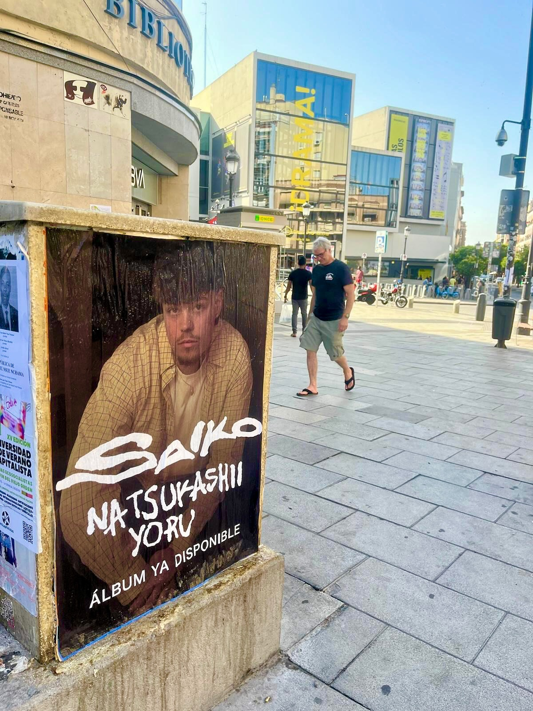

Hay lanzamientos que se anuncian solos en redes, pero la calle sigue siendo el sitio donde mucha gente te descubre sin buscarte. Para el estreno de *"Natsukashii Yoru"*, el nuevo álbum de Saiko, montamos una **pegada de carteles** en Madrid con un objetivo claro: que quien pasara por delante supiera que el disco ya está disponible en Spotify, Apple Music, YouTube y el resto de apps.

## Un disco de 13 canciones que pide calle

El proyecto llega con 13 canciones y un hilo que se repite: la nostalgia y la sanación. Dentro hay colaboraciones de estilos muy distintos, como el pop-rock de *"Mariposas"* con Leire Martínez o el reguetón de *"Lokenecesitas"* junto a Omar Courtz. Con un material así, la campaña tenía que hablarle a públicos variados y no quedarse en un solo circuito.

Ahí es donde entra el **street marketing**: llevar el anuncio al espacio urbano, al recorrido que hace la gente cada día, y repetirlo hasta que el nombre del disco se quede en la cabeza.

## Cómo se organiza la pegada de carteles en Madrid

El trabajo empieza mucho antes de pegar el primer cartel. Antes de salir a la calle hicimos esto:

- Elegimos ubicaciones con tránsito de público joven y zonas de paso constante.
- Preparamos un cartel que se entiende en un segundo, con el título del álbum y el aviso de que ya está disponible.
- Ajustamos los horarios de pegado para trabajar sin molestar y con el menor tráfico posible.
- Revisamos después que los carteles siguieran en su sitio y en buen estado.

La idea no es llenar la ciudad de papeles, sino colocar cada cartel donde tiene sentido y donde se va a ver. En las fotos de la campaña el cartel aparece en primer plano, con el nombre del disco y el aviso de disponibilidad, que es justo lo que buscábamos: que se lea rápido y quede claro dónde escucharlo.

## Por qué funciona para anunciar un álbum

Una campaña de este tipo genera una presencia que no se puede saltar con un botón de "omitir". Y además se comparte: cuando el trabajo sale bien, se mueve en redes con etiquetas como #wildposting, #pegadadecarteles o #flyposting, y eso multiplica el alcance sin gastar más.

Para sellos, artistas y marcas de música, la combinación es sencilla: carteles en la calle para llegar a quien no te sigue todavía y redes para quedarte con quien ya te conoce. Si tienes un lanzamiento cerca, escríbenos y vemos cómo llevarlo a la calle.
