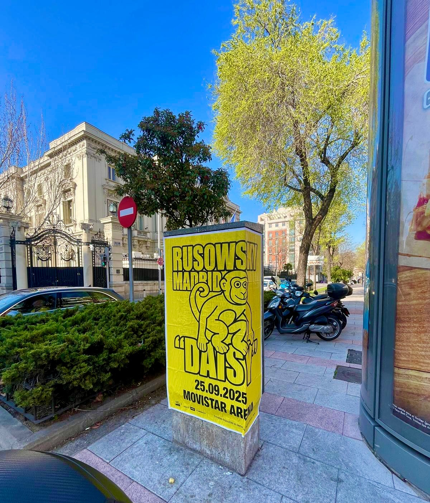

El pop alternativo español tiene una cita clave marcada en el calendario: el 25 de septiembre de 2025. Esa noche, el artista rusowsky presentará en directo su esperado álbum debut *"DAISY"* en el emblemático Movistar Arena de Madrid. Para un acontecimiento de esta relevancia, conseguir una gran visibilidad en la ciudad era fundamental. Por eso, llevamos a cabo una campaña de **pegada de carteles** pensada para conectar de forma directa con la gente en el día a día.

## Carteles amarillos que captan todas las miradas

En esta acción de **street marketing**, la apuesta visual fue clara y rotunda. El cartel promocional utiliza un fondo amarillo muy vivo combinado con tipografía negra de gran tamaño y la ilustración central de un mono. Este contraste hace que la gráfica resulte imposible de ignorar para cualquiera que pase caminando por la acera.

El diseño transmite a la perfección la identidad del artista e incluye de manera limpia los datos clave del concierto:

- Artista: rusowsky
- Evento: Presentación del álbum *"DAISY"*
- Fecha: 25 de septiembre de 2025
- Lugar: Movistar Arena de Madrid
- Venta de entradas: movistararena.es

## Presencia en la calle para conectar con el público

Con temas tan conocidos como *"SOPHIA"* o *"ALTAGAMA"*, el proyecto de rusowsky se ha consolidado como un referente del género. La pegada de carteles en elementos urbanos como columnas a pie de calle permite que la noticia del concierto forme parte del entorno cotidiano de la ciudad. Es una manera sencilla y efectiva de generar expectación, recordar la fecha del show y llevar al público directamente a la compra de pases.

## ¿Buscas promocionar tu próximo evento en la calle?

Si organizas un concierto, un festival o el lanzamiento de un proyecto creativo, estar presente en la vía pública sigue marcando la diferencia. En nuestra agencia nos encargamos de planificar y ejecutar acciones urbanas adaptadas a lo que necesita cada cliente para lograr el máximo impacto. Contáctanos y te ayudaremos a llevar tu campaña a las calles.
