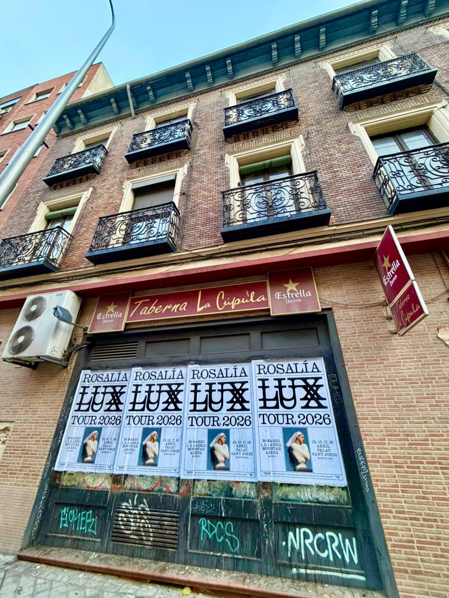

Cuando se anuncia una gira como *"LUX TOUR 2026"*, llega un momento en el que el cartel sale del móvil y aparece en la calle. Eso es lo que hicimos para Rosalía en Madrid y Barcelona. Nos encargamos de la **pegada de carteles** en las dos ciudades, con un trabajo de **street marketing** pensado para que el anuncio llegara a quien pasa por la calle cada día, mire o no mire las redes.

## Las fechas que se vieron en la calle

El calendario venía claro desde el principio. En Madrid, el Movistar Arena acoge los conciertos del 30 de marzo y del 1, 2, 3 y 4 de abril. En Barcelona, el Palau Sant Jordi recibe a la artista el 13, 15, 17 y 18 de abril. Con esas fechas en la mano, el reto era que el mensaje se viera en la calle y que la gente asociara cada ciudad con su concierto. Nada de esperar a que el público llegara a nosotros: salimos a buscarlo.

## Cómo organizamos la pegada en las dos ciudades

Cada ciudad tiene su ritmo y su manera de moverse, así que el trabajo se planificó por separado, aunque con el mismo criterio. Estos son los pasos que seguimos:

- Selección de los espacios donde el cartel tenía más sentido, siempre con los permisos en orden.
- Impresión de los carteles con el diseño de la gira y las fechas de cada ciudad.
- Colocación por zonas, con un equipo que va revisando el estado de cada soporte.
- Repaso final para comprobar que todo sigue en pie y se ve bien.

No hay más misterio: es un trabajo de calle, con gente que madruga y que conoce la ciudad. La pegada se hace andando, mirando y volviendo a pasar por donde ya has estado. Y en una campaña con dos ciudades a la vez, esa parte de control es la que marca la diferencia entre verse mucho o verse a medias.

## Qué aporta esto a un concierto

Un concierto se llena con público que compra entradas, y ese público está en la calle mucho antes de estar en la taquilla. La publicidad exterior hace algo que otras cosas no hacen: repite. Ves el cartel al ir a trabajar, al volver y al salir el fin de semana. En dos ciudades como Madrid y Barcelona, con la cantidad de gente que se mueve a diario, ese impacto se nota.

Además, hay un detalle que nos gusta: el cartel no distingue entre seguidores y curiosos. Le habla a todo el mundo. Para una gira como *"LUX TOUR 2026"*, que se presenta en dos recintos grandes del país, eso es justo lo que se busca. No hace falta explicar quién es Rosalía: hace falta que la fecha y el sitio queden claros para quien pasa por delante.

Si tienes una gira, un festival, un estreno o un lanzamiento y quieres que se vea en la calle, en Madrid, en Barcelona o donde haga falta, escríbenos. Nosotros nos encargamos del resto.
