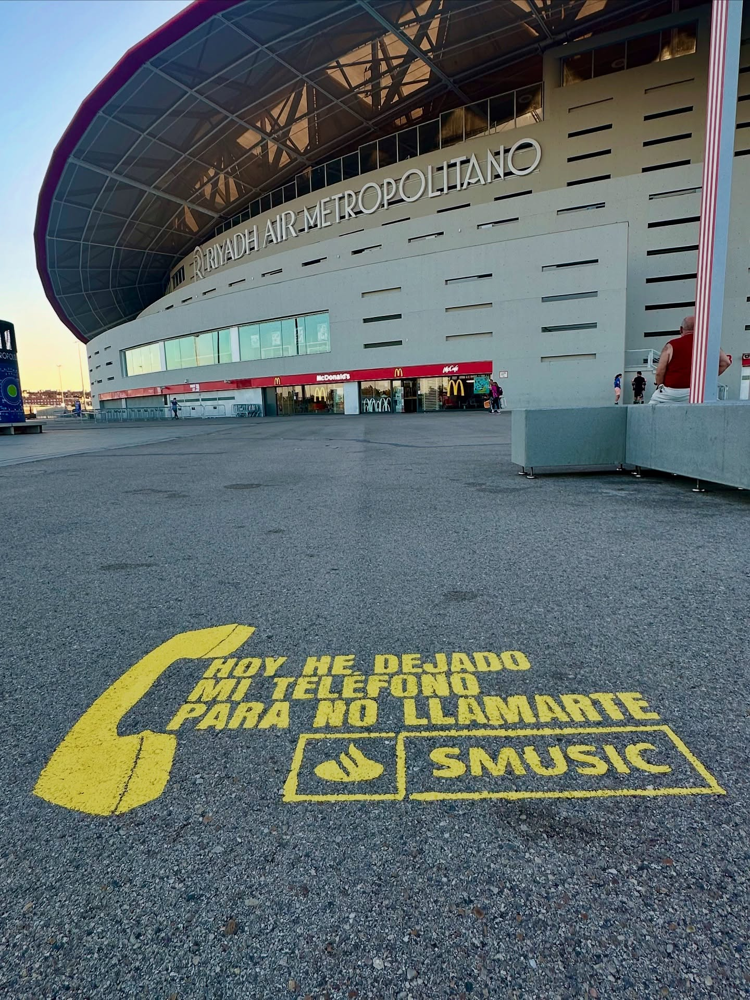

On the past 30 and 31 of July, music was felt strongly both inside and outside the venue. During Aitana's concerts at the Estadio Riyadh Air Metropolitano in Madrid, we carried out a special action for S Music with which we accompanied thousands of followers long before the stage lights came on.

## Bringing music to the stadium's surroundings

The goal of this **street marketing** campaign was to connect with people in a direct and close way. We filled the areas surrounding the stadium with highly recognizable lines from the artist's songs, such as the verse *"Hoy he dejado mi teléfono para no llamarte"*, printed directly onto the pavement next to the brand's logo.

This integration in the street perfectly complements traditional **poster pasting** in urban spaces, turning the way to the event into part of the show itself. Attendees didn't just read the lyrics; they took photos with them and shared them on their social media.

## Why creative outdoor advertising works

Street-level actions at large music events offer key advantages for any brand that wants to stand out:

- **Direct impact:** We reach the target audience at the moment of greatest enthusiasm and openness.
- **Emotional connection:** Using messages or lyrics linked to the artist generates immediate goodwill.
- **Organic visibility:** Creative installations invite fans to create content and share it on their own.

Any large-scale event is a perfect opportunity to be seen. Whether through a well-planned poster pasting campaign or actions on the ground and urban media, the concert's surroundings are the ideal stage to connect with people in a natural way.

## Make your brand sound on the street

If you have an event, a launch or a campaign in mind and you're looking to capture your audience's attention at strategic points, our team takes care of bringing your message to the street effectively and originally. We design and execute tailor-made actions so that your brand doesn't go unnoticed.
