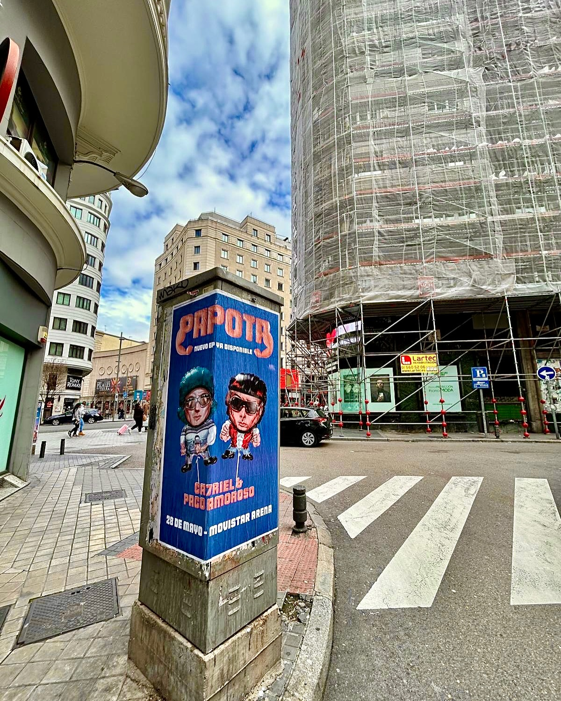

Ca7riel and Paco Amoroso are back, and they have done so with an EP that is already out on the street. We, as outdoor advertising specialists, made sure the announcement reached every corner with a **poster pasting** campaign that has given a lot to talk about.

## A poster with the duo's personality

The design we have deployed is faithful to the artists' style: two caricatures of Ca7riel and Paco Amoroso wearing sunglasses, drawn in a humorous vein, and the direct message: 'PAPOTA EP NOW AVAILABLE'. The image says it all. Nothing more is needed for anyone passing by to find out that the EP *«PAPOTA»* can already be listened to on all digital platforms.

Furthermore, the campaign arrives at the best moment. After their stint at the Tiny Desk, the duo is in full effervescence and the poster pasting serves as the starting gun for their next big challenge: the concert on 28 May at the Movistar Arena in Madrid.

## A campaign designed to generate expectation

**Street marketing** has a clear advantage: people see it in their day-to-day lives, without filters or algorithms. With this action, we have managed to make the release of *«PAPOTA»* become a tangible event on the street. The poster not only announces the EP, it also reminds that tickets for the concert are already on sale and that anyone who wants to experience it live has to hurry.

These are the key messages of the campaign:

- *«PAPOTA»* is already available on all platforms.
- The concert will be on 28 May at the Movistar Arena in Madrid.
- Tickets are on sale and can be obtained before they run out.

## Poster pasting as an urban loudspeaker

Working with artists like Ca7riel and Paco Amoroso is a luxury, because their proposal invites daring campaigns. Poster pasting remains one of the most effective formulas within street marketing for generating noise and connecting with the public. No screen can replace the feeling of coming across a well-placed poster in the middle of the city.

On this occasion, the result has been a clean, direct and highly visual campaign that accompanies the EP release and warms up engines for the date at the Movistar Arena. If you also want your next project to be out on the street, you already know how we do it: with poster pasting and a lot of attitude.
