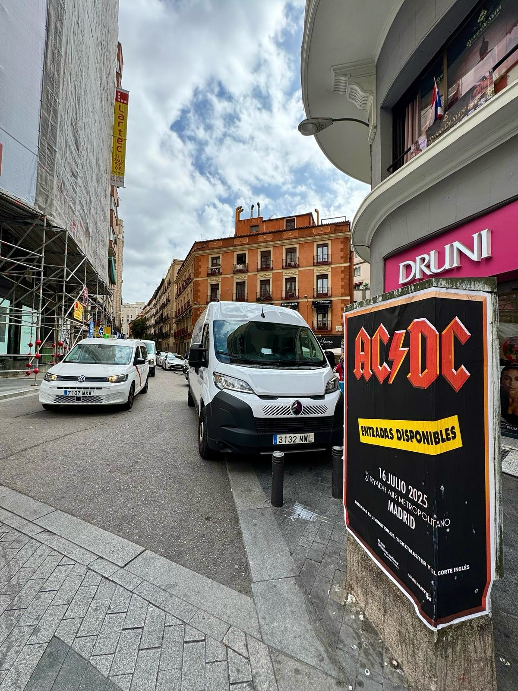

The thunderous rock of the legendary band AC/DC returns to Spain and the anticipation on the streets of the capital is total. To publicize such a landmark event for live music, we developed an urban advertising action through **poster pasting**, ensuring that the group's followers are aware of this unmissable date in Madrid.

## The power of live music at street level

When an international tour arrives in the city, achieving an immediate visual impact is decisive. Next Wednesday, July 16, 2025 at 21:30, the legendary band will offer a concert that promises to be unforgettable at the Riyadh Air Metropolitano parking lot in Madrid. To communicate this great event, we opted for **street marketing** as the ideal channel to connect with the public in their daily lives.

In the campaign images you can see how the posters have been placed on public road supports, perfectly integrated into the urban environment of Madrid. They highlight the essential information that any fan needs to know:

- Band and tour: AC/DC with their *«Power Up Tour 2025»* tour.
- Date and time: Wednesday, July 16, 2025 at 21:30.
- Location: Riyadh Air Metropolitano parking lot in Madrid.
- Authorized points of sale: Livenation.es, Ticketmaster and El Corte Inglés.

## Strategic visibility for event campaigns

The physical format at street level remains one of the most powerful supports for the promotion of concerts and festivals. As they walk through the city, people come face to face with the show's posters, which arouses interest and the impulse to buy tickets. The poster design, with red and yellow letters on a black background and the notice of available tickets, conveys the band's characteristic energy.

Thanks to poster pasting in high-traffic points, we managed to place the concert's image in the daily routine of the city. If you organize a concert or any type of show and need your message to reach the street directly, we offer you tailor-made solutions to promote your event and achieve maximum impact.