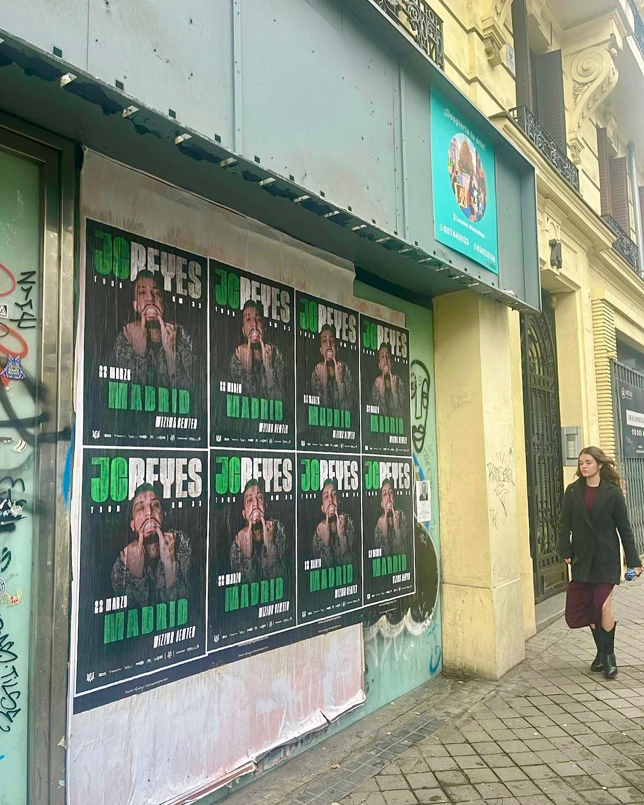

When there is a powerful concert in the city, the street has to find out for real. That was exactly what we did with the campaign for artist JC Reyes and his *"Tour KM 33"* tour in Madrid. With his next date set for March 22 at the Movistar Arena, the goal was crystal clear: to ensure that no fan was left without their ticket for not having found out in time.

## Direct visual impact on the urban environment

For this job we opted for a strategic **poster pasting** on walls and facades at street level. The poster design contrasts dark tones with intense green lettering, making it easy for any pedestrian walking along the sidewalk to instantly identify the artist, the date, and the show venue.

**Street marketing** actions allow us to connect in a direct and real way with the public that lives the city on a day-to-day basis. By placing the event's image on everyday urban supports, we make the March 22 date become part of the usual landscape of passersby.

## Key points of the advertising action

A well-executed poster pasting turns passing walls into authentic advertising loudspeakers. In this project for *"Tour KM 33"* by JC Reyes we focused on the following aspects:

- Placement on facades and street-level supports with high visibility.
- Arrangement of the posters in a grid to multiply the visual attention call.
- Clear message with the artist's name, the event date, and the city.

## Make your event sound on the street

If you organize a concert, a tour, or any type of event and need to fill the venue, going out to the street remains the most effective option to attract the public's attention. We take charge of bringing your project to the urban environment with maximum visibility. Write to us and we will prepare your next campaign.
