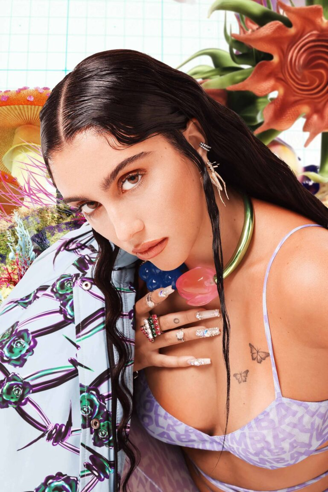

Bimba y Lola's autumn-winter 2021 is tinged with futuristic creativity in the #thisisTECHNONATURE campaign. A proposal for which the Galician fashion and accessories firm has fused the talent of names such as Isamaya Ffrench, Lourdes Leon and Carlos Sáez.

Surrounded by intense colors and bright lights, multidisciplinary artist Lourdes Leon ventures into an unknown dreamlike dimension, in which the flora and fauna present in Bimba y Lola's latest collection appear. Original design pieces among which the LB bags in quilted leather or covered in colored «fake fur» stand out, as well as a T-shirt that glows in the dark or a complete selection of costume jewelry, in which rings, chain bracelets or chokers are not lacking.

With Madonna's daughter as the muse of the images captured by Hugo Yangüela, Bimba y Lola has counted on our services to carry out a poster-pasting action in Madrid.

