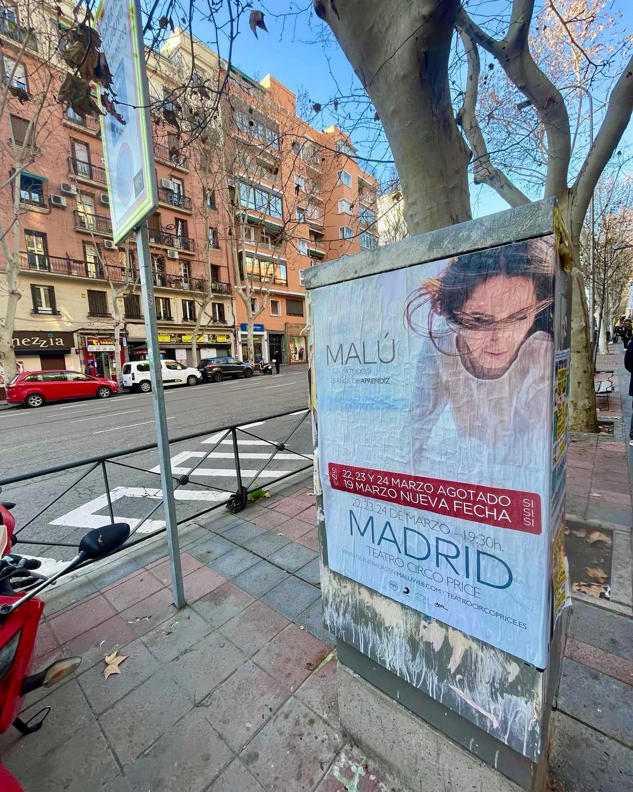

Malú Celebrates 25 Years of Career with Her Tour «A Todo Sí, 25 Años de Aprendiz» in 2024.

The beloved Spanish singer Malú will celebrate her quarter century in music with a tour titled «A Todo Sí, 25 Años de Aprendiz» that will tour the main cities of Spain throughout 2024. After taking a break to focus on her personal life, the Madrid-born artist promises to delight her loyal fans with a show full of her greatest hits and new songs.

In recent weeks, the streets of Madrid have been invaded by the advertising posters we have pasted to announce Malú's highly anticipated tour. The massive posting of this marketing campaign has generated great expectation among the singer's followers.

"I am immensely excited to celebrate my 25 years on stage with this very special tour," commented Malú. "It will be a journey through all the stages of my career, connecting with my roots as «Aprendiz» but also exploring new artistic territories. I promise a visually impressive experience full of energy."

Fans can expect a repertoire that spans Malú's entire musical career, including hits from her acclaimed albums «Aprendiz», «Desueño», «Sí» and many more. But there will also be a generous sampling of her upcoming studio album, still untitled, from which the much-talked-about single «Reviví» has already been released.

With her powerful voice, overwhelming charisma on stage and a catalog of hits to frame, Malú promises that her tour will be one of the most coveted and special of 2024 in Spain. A true celebration that no fan will want to miss!
