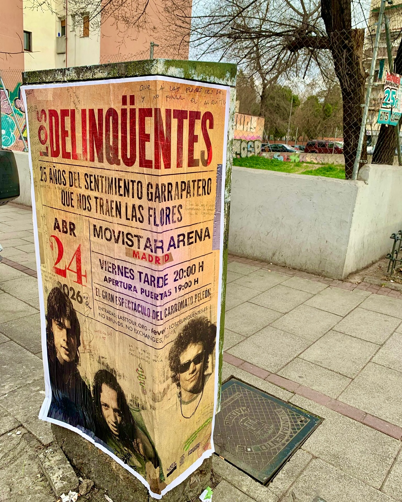

After almost 15 years of waiting, the return of Los Delinqüentes to the stages is already a reality that can be felt in the city. To celebrate the 25th anniversary of their first album, *"El sentimiento garrapatero que nos traen las flores"*, we have taken to the streets of Madrid to give the news as it deserves. A well-placed **poster pasting** is the most direct way to let all followers know that on April 24, 2026 there is a historic reunion at the Movistar Arena.

## The visual impact of street-level advertising

For a moment as long-awaited as the return of the masters of garrapatero feeling, a **street marketing** action was needed that would live up to the people's eagerness. Urban supports and concrete elements right on the sidewalk are perfect for naturally catching eyes as people walk through the city.

The poster recovers the group's classic image and aesthetic, announcing *"El gran espectáculo del carromato peleón"* and showing all the key details of the event: doors open at 19:00 h and the show begins at 20:00 h on Friday, April 24, 2026.

## Why poster pasting makes a difference at large events

At concerts and events of this caliber, being physically present on the streets helps reinforce the message in a very close way. Poster pasting provides clear advantages when it comes to publicizing a show at an important venue:

- **Continuous visibility**: the message is exposed 24 hours a day to the constant flow of pedestrians.
- **Direct connection**: coming across the group's graphics in the middle of your daily route instantly awakens the memory of their songs.
- **Authentic character**: the paper format on urban supports fits perfectly with the band's cheerful and streetwise style.

## Make your next event stand out in the city

If you are going to organize a tour, a special concert, or an album release and you want to reach the public directly, street-level outdoor advertising continues to deliver magnificent results. We take care of placing your posters in the right spots so that your project stands out in the urban environment.