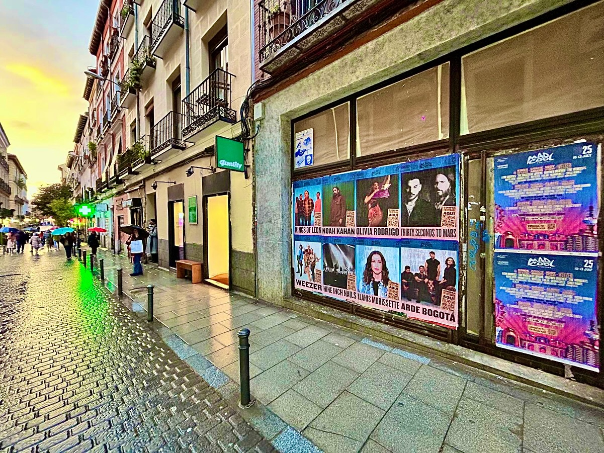

Mad Cool 2025 is back and we have had the luck to put a face to it on the streets of Madrid. With a lineup that takes your breath away, from July 10 to 13 at the Recinto Iberdrola Music, the festival promises four days that are going to get people talking. Our team made sure no one missed it with a good **poster pasting** across the city. Because when a festival of this level lands, the whole city has to know.

## Poster pasting: the classic that still works

There is nothing like seeing a wall full of posters to know that something big is coming. In this case, the walls of Madrid were filled with the *"Mad Cool 2025"* poster. The image says it all: a wall covered with posters announcing Kings of Leon, Olivia Rodrigo, 30 Seconds to Mars, Noah Kahan, Arde Bogotá and many more. That is the magic of poster pasting: it turns any corner into a showcase and makes people look up from their phones. And with such a striking design as this festival's, the result is even better. Behind each poster there is planning: choosing the busiest areas, preparing the material and finding the perfect wall. It is a job that requires patience and a good eye, but when you see the result, it is worth it.

## A luxury lineup for a campaign to match

The festival has announced an impressive lineup, and we could not fall short. From July 10 to 13, the Recinto Iberdrola Music will host four days of music and emotions. Tickets are already on sale at madcoolfestival.es. Our mission was for everyone to find out, and the best way to do it is with a poster pasting that does not go unnoticed. On every wall, on every corner, the name of *"Mad Cool 2025"* appeared to remind everyone that the summer is going to be epic.

The lineup includes:
- Kings of Leon
- Olivia Rodrigo
- 30 Seconds to Mars
- Noah Kahan
- Arde Bogotá
- and many more

## Why street marketing keeps winning

In a world full of digital ads, **street marketing** has something special. Seeing a poster pasted on the wall connects you with the event in a more real way. Poster pasting is a technique that still works because it reaches people in their daily lives, right on the street. There is no need to scroll or wait for a video to load: the message is there, in front of you. And when the poster is the one for *"Mad Cool 2025"*, the excitement is noticeable. People stop, look at it, comment on it. Furthermore, it is a form of advertising that invites interaction: people take photos, upload them to their social networks and the reach multiplies. A banner does not achieve that.

So you know: if you want your next event to be seen and felt on the street, street marketing is your best ally. We are already ready for the next one. And you?
