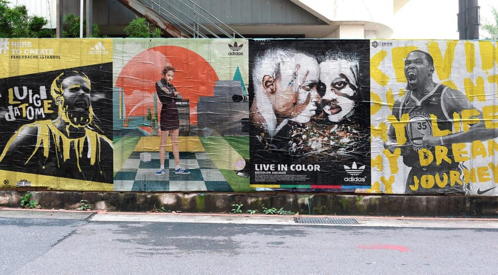

When one thinks of wild posting, they probably think of perimeter fences of construction zones papered with concert or service ads. You may not think of the brand. But you should. Wild posting provides an excellent platform to promote or create a brand. It allows companies to present what differentiates them from the competition and makes them unique.

When you focus on the brand in a wild posting campaign you will do much more than promote just an event or product. You promote your identity, which goes far beyond the exact day people see the campaign.

## How to correctly use a wild posting campaign to promote your brand?

Follow these 7 tips to make your wild posting campaign remembered and find the right place to target, bringing your message to the right people and generating a lasting marketing impact.

## Why is branding important?

First, a brief introduction to the importance of creating a recognizable brand.

The reason to create a brand is quite simple: differentiate yourself from the competition. In most of the industry, there are many companies that do the same as you. The brand is the argument for why people should choose you and not the other options. The brand makes a promise, and that promise attracts people's attention. The brand encapsulates the character of your business and packages it in an easy-to-consume way.

It is not enough to sell a product. You have to do it as best as possible, be the most creative in your industry or offer the best customer service. Something must differentiate you, otherwise people will not choose you.

Brands can choose many different images to follow, such as:

* Trustworthy and stable
* New and innovative
* Eco-conscious or supportive
 
Regardless of what you choose, you must deliver that image consistently. This is where wild posting and poster pasting campaigns come in. You can convey the same message in an infinite variety of places with a wild posting campaign.

These tips will help you maintain your message and achieve the results you want.

## 1. Determine how the wild posting campaign fits into your strategy.
 
> The strategy of a marketing campaign is the four questions of advertising: what, where, when, and who receives your messages.

Although we already know the how, since you have chosen to carry out a wild posting campaign, you must determine the other three questions through the use of data and experience.

For example, you should target your wild posting campaign in an area where it will reach consumers who are likely to buy your product. If you are promoting an album by Lady Gaga or Viva Suecia, for example, you probably want to advertise it somewhere or in an urban environment where their fans are likely to be, such as on the way to festivals like Mad Cool or BBK Live.

## 2. Define your goals before starting.

Carrying out a poster pasting or wild posting campaign without a prior strategy is simply wasting your money. You must set clear objectives for your campaign. When we do a wild posting campaign you may also want to gain followers or likes on social networks, even boost album sales.

Wild posting can be part of larger-scale campaigns that can also include other marketing elements such as advertising on public-use vehicles like buses or even billboard campaigns.

## 3. Use creative elements that encourage brand development efforts

The creativity we use in wild posting is fundamental. People absorb repeated images and associate them with your company and then they will think of it every time they see similar creativity.

Creating associations keeps it in the minds of potential customers and that is why wild posting is such an effective system. Repetition generates recognition. Therefore, you need incredible creativity that attracts people's attention. It is worth investing in professional assistance for this because professionals understand the difference between an attractive drawing or logo and a motivating one.

You don't want people to think: «That's cute.» You want them to think: «I need that.»

## 4. Add words (sometimes) but choose them very carefully

Good copy can reinforce your brand message in a wild posting campaign, but it should not be the focus of it. Wild posting is a more visual broadcast medium than almost any other form of outdoor advertising.

Since it involves a repetition of images several times, you can use different paper colors or other techniques to make it stand out, but an inappropriate text can cause the message we want to convey to our customers to be distorted.

Limit the words you use and make sure they are truly impactful. They must convey vital information or a limited slogan that can later be linked to your brand. For example, Nike's «Just Do It» is an example of an iconic brand that effectively combines the visual (curve) with the words of the message itself.

Six words or even less is good. But don't add words just to have them. A successful wild posting campaign can be achieved without writing absolutely anything.

## 5. Emphasize consistency in your messages.

Branding is about consistency. That doesn't mean using exactly the same creativity every time, but it does mean conveying the same message.

Consider what you want to say about your company and how you want to say it. A wild posting campaign is so simple that it is easy to underestimate it and turn it into something insignificant. Don't do that.

## 6. Take your time.
We are sure that you want something you are happy with and that satisfies you. Get used to the idea that the same message will be pasted all over the city, and if you decide to achieve something without working on it enough or try to do it at home without investing enough effort in a professional-looking image, you will end up frustrated when you see your campaign everywhere.

## 7. Consider the “data” and experience in all decision-making.

At Urban Style Publicity we believe that everything is better by analyzing the data that a wild posting campaign provides us and the experience we have behind us working with the best national and international companies.

While we plan your distribution strategy and where to place the wild posting campaign, you observe the city and all the small things that play a role in each marketing or advertising campaign.

You should always have a firm idea of why you are doing something and be able to back it up with numbers. This applies both to creating a brand, as well as to selling or promoting an event or service.

> Sometimes, when we say «data», people's eyes open wide, but sincerely at urban style publicity we believe that all effective advertising is based on data. Anyone who tells you otherwise does not understand the business. That is why we have been the leading company in poster pasting and wild posting for more than 15 years, because we can prove it with “data”.
