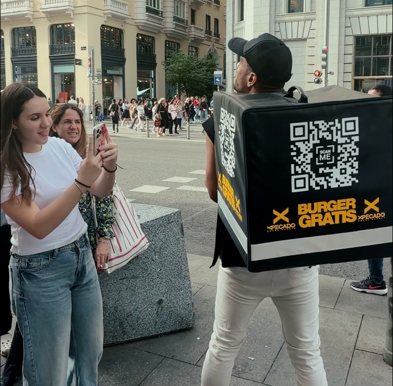

Dans le paysage actuel de la publicité extérieure, capter l'attention du consommateur et marquer sa mémoire n'est pas toujours une tâche facile.

Les personnes se déplacent à grande vitesse, connectées à leurs téléphones et de plus en plus immunisées contre les impacts statiques traditionnels sur la voie publique. C'est pourquoi, pour connecter de manière authentique et surprenante, les marques doivent évoluer et offrir plus qu'un produit ou un bon design : elles doivent générer des moments inoubliables.

C'est précisément sous cette prémisse que nous avons développé notre dernière **action spéciale de street marketing dans les rues de Madrid**, conçue pour surprendre, interagir et connecter directement avec notre public.

## L'animateur qui cachait une grande surprise

<iframe
  class="float-left mt-1 mr-8"
  width="270"
  height="480"
  src="https://www.youtube.com/embed/W2ZaN1U_Wts"
  title="YouTube video player"
  frameBorder="0"
  allow="accelerometer; autoplay; clipboard-write; encrypted-media; gyroscope; picture-in-picture; web-share"
  allowFullScreen
></iframe>

Pour structurer la campagne, nous avons décidé de miser sur un élément du quotidien totalement intégré à l'environnement urbain : le service de repas à domicile ou de livraison.

Pour ce faire, nous avons fait appel à l'habileté d'un animateur extraverti qui parcourait la ville, équipé et déguisé parfaitement en livreur habituel.

Cependant, son énorme sac à dos traditionnel ne transportait pas de livraisons conventionnelles, mais était le support de notre activation.

Sur les côtés de ce sac à dos, de manière très visible, un code QR de grande taille a été intégré. La prémisse était directe, claire et tentante : la possibilité d'obtenir un délicieux **hamburger xPecado entièrement gratuit** pour tous ceux qui se décideraient à le scanner.

Une excellente et délicieuse opportunité, très difficile à laisser passer pour beaucoup de personnes.

## La valeur inestimable de l'interaction humaine

Bien que la technologie via le scan offre une accessibilité instantanée sur les appareils mobiles, l'essence originale de la dynamique allait bien au-delà du simple accès au prix.

Nous savions que, pour que cette publicité ne passe pas inaperçue, le facteur relationnel et de contact humain était le point de bascule.

Pour cette raison, l'animateur ne se contentait pas simplement de transporter le code mobile d'un endroit à l'autre. Au contraire, il interagissait résolument avec les jeunes, les familles et les passants madrilènes présents.

Il s'approchait de manière proactive en proposant de petits défis et en générant une série de situations amusantes extrêmement dynamiques avec les groupes.

Ces surprises ont transformé chaque rencontre en une expérience incroyablement ludique et participative sur le trottoir.

📲 Le processus était incroyablement simple mais hautement participatif : **interaction, scan et récompense**.

### Les résultats : Transformer la marque en pure expérience

Développer et mettre en œuvre cette action remarquable nous a laissé des résultats très positifs dans un secteur aussi concurrentiel que les loisirs, démontrant les avantages de miser sur l'activation directe du spectateur.

Cette initiative nous a permis avec grand succès :

- **Générer un _engagement_ réel dans l'environnement urbain :** En parvenant à ce que les gens laissent de côté leur routine, en captant immédiatement leur attention et en les invitant à jouer librement.;
- **Augmenter la visibilité de la marque de manière totalement organique :** Car les interactions parvenaient à attirer encore plus de curieux, servant d'excellente attraction et générant beaucoup de bouche-à-oreille en pleine rue.
- **Créer une expérience mémorable directement associée à la marque :** En renforçant un souvenir aimable, joyeux et amusant pour les passants qui ont obtenu bien plus que les hamburgers de xPecado.

Le nombre de personnes qui ont participé à l'action et qui ont goûté les hamburgers de xPecado a été une excellente conclusion.

Une fois de plus, nous avons constaté que **quand une marque s'approche du public en interagissant avec lui, la communication cesse d'être un message et devient une expérience**.
