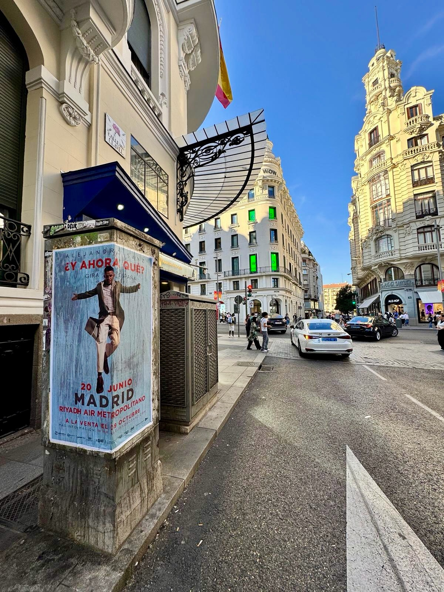

Alejandro Sanz remplit les stades, et lorsqu'il annonce une tournée en Espagne, Madrid est l'une des étapes les plus attendues. L'annonce de la tournée *«¿Y Ahora Qué?»* devait être dans la rue, et c'est là que nous entrons en jeu : dans le **collage d'affiches**. Un travail qui se voit sur le trottoir, sans que personne n'ait besoin de le chercher.

## L'annonce, au plus près de la rue

La tournée *«¿Y Ahora Qué?»* arrive à Madrid. Le concert aura lieu le 20 juin au stade Riyadh Air Metropolitano et les billets seront mis en vente le 9 octobre. Toutes ces informations, ainsi que le site officiel www.alejandrosanz.com, sont ce que nous devions mettre devant les gens qui passent chaque jour dans la ville.

Et c'est exactement ce que fait le collage d'affiches : porter le message à l'endroit où se trouve la personne, pas là où l'algorithme dit qu'elle devrait être. Sur l'image, on voit le résultat, avec l'affiche posée sur une colonne publicitaire et le message de la tournée et de la ville visible pour quiconque passe devant.

## Comment s'organise un travail comme celui-ci

Derrière des affiches dans la rue, il y a un travail de coordination qui ne se voit pas. Voici les points que nous soignons dans chaque campagne :

- Choisir des supports urbains bien visibles, comme la colonne publicitaire qui apparaît sur la photo.
- Poser les affiches avec les informations clés : la tournée, la date du concert, le stade et l'annonce de la mise en vente des billets.
- Inclure le site officiel pour que celui qui voit l'affiche puisse obtenir plus d'informations.
- Passer ensuite vérifier que tout est toujours en place et en bon état.

C'est un travail facile à expliquer et difficile à bien faire. Si l'affiche est posée dans un endroit où on ne la voit pas, elle ne sert à rien. Et si elle est mal posée, elle dure deux jours.

## Pourquoi cela fonctionne pour vendre des billets

Un concert de cette taille se joue beaucoup dans les semaines qui précèdent le lancement. Le **street marketing** aide justement à ce moment-là, quand il faut mettre une date dans la tête des gens.

- Proximité : le message apparaît quand la personne est dans la rue, sans filtres ni clics.
- Mémorisation : voir la même affiche plusieurs jours de suite fixe la date et le nom de la tournée.
- Urgence : prévenir dans la rue que les billets sont mis en vente le 9 octobre pousse à agir.
- Ville : Madrid tout entière se transforme en vitrine pour l'artiste.

Pour une tournée, un festival ou un concert, l'affiche dans la rue reste l'un des formats qui offrent le meilleur rendement par rapport à ce qu'ils coûtent. Elle atteint des gens qui ne suivent pas l'artiste sur les réseaux et qui, pourtant, s'arrêtent pour la lire sur le chemin du travail.

Si vous préparez un événement, un lancement ou une tournée et que vous voulez que la ville le sache, écrivez-nous. Nous nous chargeons du collage d'affiches de A à Z et de faire en sorte que votre campagne soit visible là où elle doit l'être.
