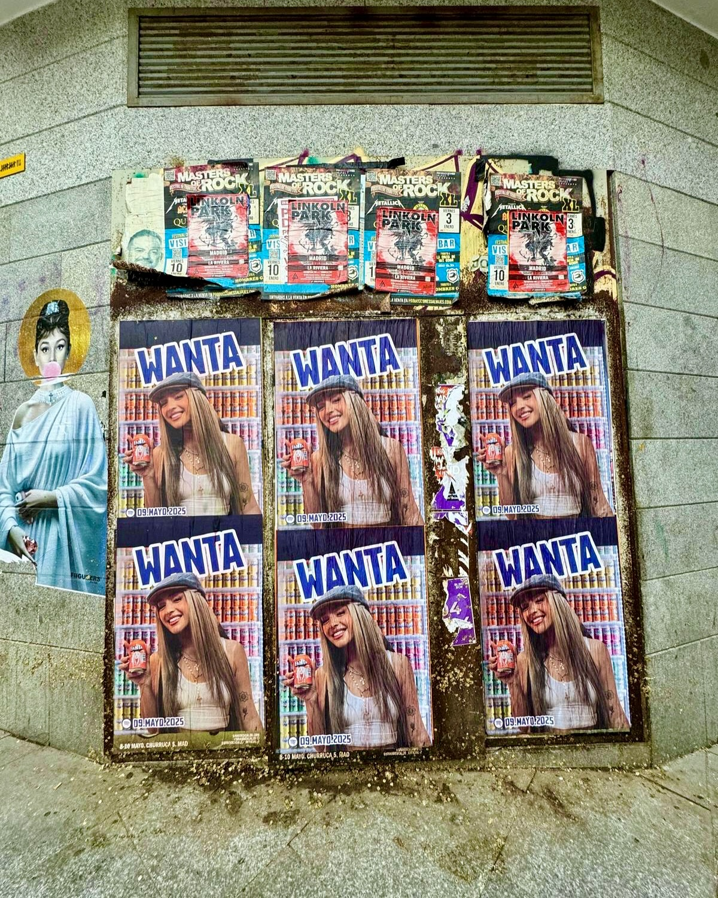

Quand une marque comme Fanta lance une campagne aussi puissante que Fanta Wanta, la rue devient la scène parfaite pour capter l'attention. Et nous, en tant que spécialistes du **street marketing**, le savions. C'est pourquoi, lorsqu'on nous a confié le **collage d'affiches** pour promouvoir cette nouvelle collection de canettes avec des artistes et des influenceurs, nous nous sommes mis au travail.

La campagne est pure énergie : des canettes de collection avec des visages connus comme Lola Índigo, El Rubius, IlloJuan et Marina Rivers. Et pour que tout le monde le sache, rien de mieux que d'envahir les rues avec des affiches bien visibles. Nous ne nous sommes pas limités à coller des posters ; nous avons conçu une stratégie d'impact pour que chaque recoin parle de Fanta.

## Un collage d'affiches pensé pour générer du hype

Notre équipe s'est concentrée sur les zones à fort passage, où les jeunes se déplacent quotidiennement. Nous avons placé les affiches aux arrêts de bus, sur les façades et les murs stratégiques, en recherchant toujours une visibilité maximale. L'idée était que, en voyant le visage de Rubius ou le style de Lola Índigo, n'importe qui veuille en savoir plus.

De plus, nous avons profité de l'esthétique colorée de la campagne. Les affiches n'annonçaient pas seulement les canettes, elles rappelaient aussi l'application Fanta pour participer et gagner des prix. Et, bien sûr, la référence à la chanson "Wanta Fanta" ne pouvait pas manquer, le titre que Lola Índigo a lancé pour l'occasion.

## Des résultats qui se remarquent dans la rue

La réponse ne s'est pas fait attendre. Durant les jours suivant le collage, les réseaux se sont remplis de photos des affiches et de personnes cherchant leurs canettes préférées. C'est là la puissance du street marketing bien fait : il génère de la conversation et rapproche la marque des gens.

- Affiches placées à des points clés de la ville.
- Design intégré à l'esthétique de Fanta Wanta.
- Mention directe des influenceurs et de l'application de récompenses.
- Promotion croisée avec la chanson "Wanta Fanta".

Si ta marque a besoin de ce type d'impact, nous le rendons possible. Le collage d'affiches reste l'un des outils les plus efficaces pour lancer un produit ou une campagne, et nous sommes experts dans son exécution avec précision et créativité.

## Ça te dit de lancer ta prochaine campagne avec nous ?

Nous travaillons avec des marques de toutes tailles et de tous secteurs. Que ce soit pour promouvoir un événement, un produit ou une collection limitée, notre équipe de street marketing est prête à sortir dans la rue et à faire du bruit. Comme avec Fanta, nous transformons une idée en une expérience visuelle dont les gens se souviennent.

Contacte-nous et découvre comment nous pouvons aider ta marque à briller à chaque coin de rue.
