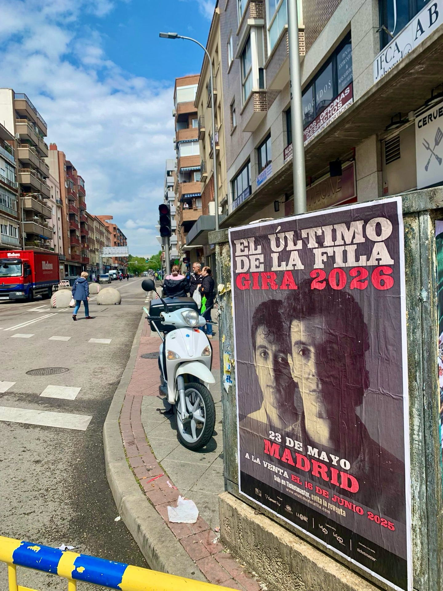

Quand un groupe mythique comme El Último de la Fila annonce son retour, il faut être à la hauteur. Dans notre agence de street marketing, c'était clair pour nous : la meilleure façon d'annoncer les concerts de 2026 était une bonne **pose de posters** en pleine rue. Et c'est ce que nous avons fait.

## Le retour de El Último de la Fila

Après près de trois décennies, Manolo García et Quimi Portet remontent sur scène. La nouvelle a été l'une des plus attendues par les fans du rock espagnol, et nous avons eu le privilège de lui donner un visage dans les rues. La tournée démarre avec deux dates déjà marquées en rouge :

- Barcelone : 3 mai.
- Madrid : 23 mai.

Les billets sont déjà en vente via Ticketmaster.es, les fans n'ont donc aucune excuse pour manquer les retrouvailles.

## Notre pose de posters en action

Sur l'image, on voit l'un des posters que nous avons placés : en plein trottoir, à la lumière du jour, là où les passants ne peuvent pas l'éviter. C'est ainsi que fonctionne le **street marketing** : le message fait partie du paysage urbain. Pour cette campagne, nous avons conçu une pose de posters qui amène le nom mythique de El Último de la Fila dans les coins les plus fréquentés de Madrid et Barcelone.

## Pourquoi le street marketing est-il parfait pour une tournée ?

Un concert est un événement qui vit dans la rue : les gens en parlent, partagent des billets et se donnent rendez-vous pour y aller. C'est pourquoi la publicité extérieure est le complément idéal. La pose de posters génère de l'attente et crée une connexion directe avec le public qui se promène dans la ville. De plus, c'est une option très flexible et avec un grand impact visuel.

Si tu as un événement ou un lancement en préparation, nous pouvons faire la même chose pour toi. Nous veillons à ce que ton message soit là où il doit être : dans la rue.
