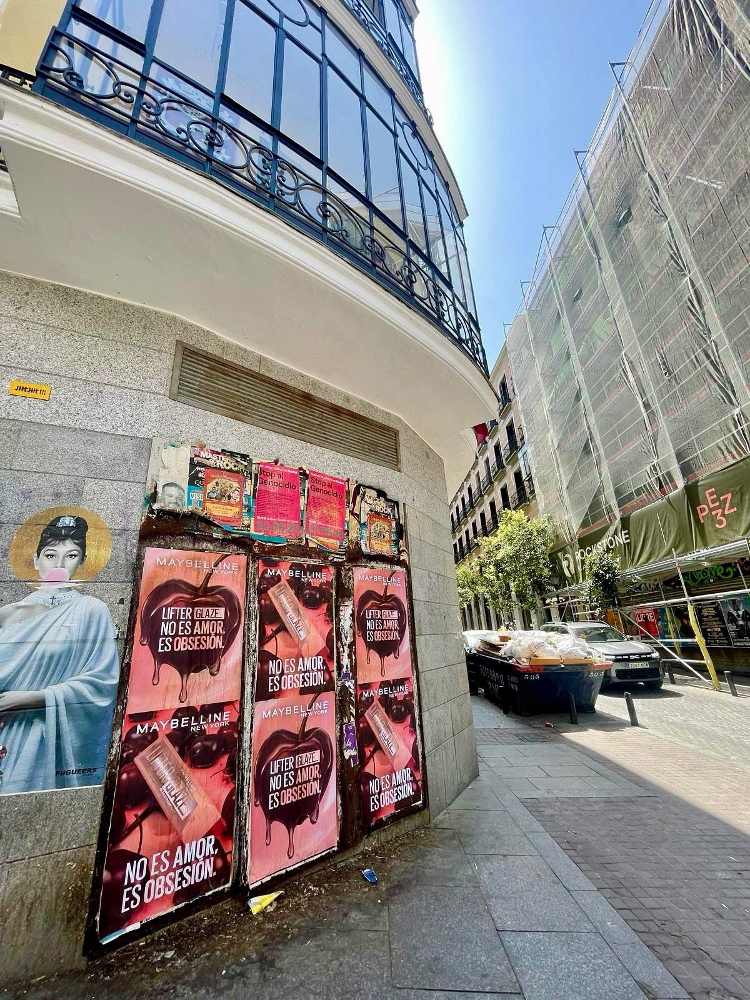

Lorsqu'une marque de référence dans la cosmétique lance un produit puissant sur le marché, être présent dans la rue fait toute la différence. Maybelline New York a présenté son nouveau brillant Lifter Glaze et nous nous sommes chargés de faire résonner son message dans le quotidien de Madrid et Barcelone avec un design impossible à ignorer.

## L'impact de l'affichage extérieur dans le secteur de la beauté

Le monde de la cosmétique vit de l'image et de la transmission immédiate de sensations. Avec la campagne de son nouveau rouge à lèvres, l'objectif était clair : montrer cette finition pulpeuse et une couleur intense directement à la vue de milliers de piétons.

Le **street marketing** permet aux marques consolidées de connecter avec le public d'une manière très fraîche et organique. En plaçant les visuels dans des lieux fréquentés, le message s'intègre dans la routine quotidienne des gens sans interrompre, permettant au produit de rester dans l'esprit de ceux qui passent par là.

## Visibilité stratégique sur des supports urbains

Grâce à une technique soignée de **collage d'affiches**, nous avons installé la campagne dans des angles et des façades clés au niveau de la rue. Le contraste des images, où ressortent les teintes sombres et rosées aux côtés de cerises nappées de brillance, s'est parfaitement intégré à l'environnement urbain.

Parmi les éléments clés de cette action, on distingue :

- Des affiches au design graphique puissant qui mettent en valeur le produit et la finition de la formule.
- Une présence directe dans les rues très fréquentées de Madrid et Barcelone.
- L'incorporation claire du slogan *« No es amor... es obsesión »* pour renforcer le concept du lancement.

## Faites de votre produit le centre d'attention

Les campagnes urbaines restent l'une des méthodes les plus directes et rentables pour faire connaître un nouveau lancement. Si vous planifiez votre prochaine action commerciale et cherchez un collage d'affiches qui obtienne de vrais résultats et attire l'attention de vos clients potentiels, nous pouvons vous aider à la planifier et à l'exécuter sur mesure.