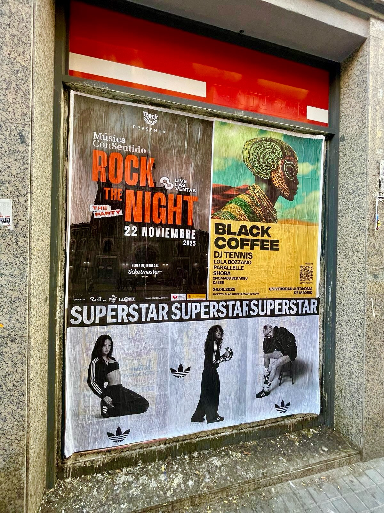

"De l'asphalte aux rues du monde". C'est par cette phrase qu'adidas Superstar résume une campagne déjà vue à Madrid et Barcelone. L'idée était simple : sortir la chaussure de la vitrine et la mettre là où les gens circulent. C'est ce que nous avons fait avec un **collage d'affiches** en pleine rue.

## Ce qui a été vu à Madrid et Barcelone

Dans les deux villes, les affiches d'adidas Superstar sont apparues. Sans écrans, sans vidéos et sans rien qui dépende d'une batterie. Du papier, un mur et un emplacement pensé pour que le message croise le chemin de ceux qui passent par là.

C'est tout l'enjeu du **street marketing** : ne pas interrompre, faire partie du paysage. Celui qui marche devant ne voit pas une publicité, il voit la ville. Et c'est là la différence avec d'autres formats.

Le wild posting fonctionne parce qu'il est direct. L'affiche est à hauteur de regard, sur le chemin de la maison au travail, à l'angle habituel. Il n'y a rien à chercher.

## Pourquoi ce format convient à une marque comme celle-ci

Adidas Superstar parle d'histoire et de style dans la même phrase. Ce mélange demande la rue, pas une vitrine. C'est pourquoi la campagne s'est appuyée sur des affiches et non sur un autre type de support.

- Elle vit là où vivent les gens : trottoirs et murs que l'on croise chaque jour.
- Impossible à sauter : ici, pas de bouton « passer » ni de bloqueur qui tienne.
- Elle se répète sans lasser : l'affiche est toujours là un jour après l'autre, et elle reste en tête.
- Elle parle la langue de la marque : en l'occurrence, le style urbain que réclame la chaussure.
- Elle se voit dans deux villes à la fois : Madrid et Barcelone, avec le même message.

## Laisser une empreinte dans la rue

Le message de la campagne encourage à marcher d'un pas ferme et à laisser une empreinte. C'est ce que cherche la chaussure et c'est ce que cherche un bon **collage d'affiches** : que la marque occupe un morceau de ville sans demander la permission à l'écran du téléphone portable.

Quand l'affiche est bien posée, bien collée et au bon endroit, les gens la regardent, la commentent et la partagent. Il n'en faut pas plus.

Si tu as une marque, un lancement ou une collection que tu veux voir dans les rues de ta ville, écris-nous. Nous l'emmenons là où sont les gens.

