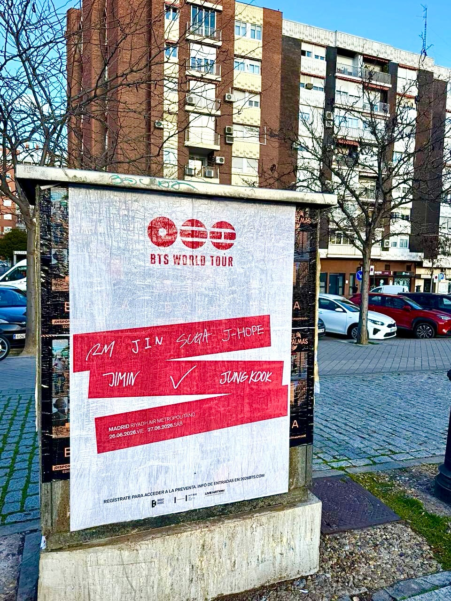

Madrid sait déjà que BTS revient sur scène. Nous nous sommes chargés d'occuper les rues pour annoncer les dates du *«BTS World Tour»* les 26 et 27 juin au Riyadh Air Metropolitano. Si vous voulez que votre événement résonne dans toute la ville, le **collage d'affiches** reste l'un des moyens les plus directs et efficaces de toucher le public.

## Un impact visuel direct dans l'espace public

Le phénomène K-pop déplace les foules et l'attente pour voir RM, Jin, Suga, J-Hope, Jimin, V et Jung Kook est énorme au sein du collectif ARMY. Pour un événement de cette envergure, une action de **street marketing** permet à l'information de parvenir aux piétons lors de leur parcours quotidien dans la ville.

Les supports urbains utilisés affichent toutes les informations clés dont les fans ont besoin :

- Les dates confirmées pour les représentations dans la capitale.
- Le lieu de l'événement : le stade Riyadh Air Metropolitano.
- Les membres du groupe et la référence pour s'inscrire à la prévente des billets.

## Pourquoi la publicité urbaine booste votre événement

Être présent dans l'environnement urbain fait une grande différence au moment de promouvoir de grands spectacles. Un collage d'affiches exécuté avec rigueur aide à activer la conversation sur les réseaux sociaux, à renforcer l'image de l'artiste et à garantir que la date reste dans la mémoire des fans.

Si vous organisez un concert, un festival ou tout autre lancement culturel et que vous cherchez une campagne urbaine avec une présence réelle dans la rue, nous veillons à ce que votre message ne passe pas inaperçu.

