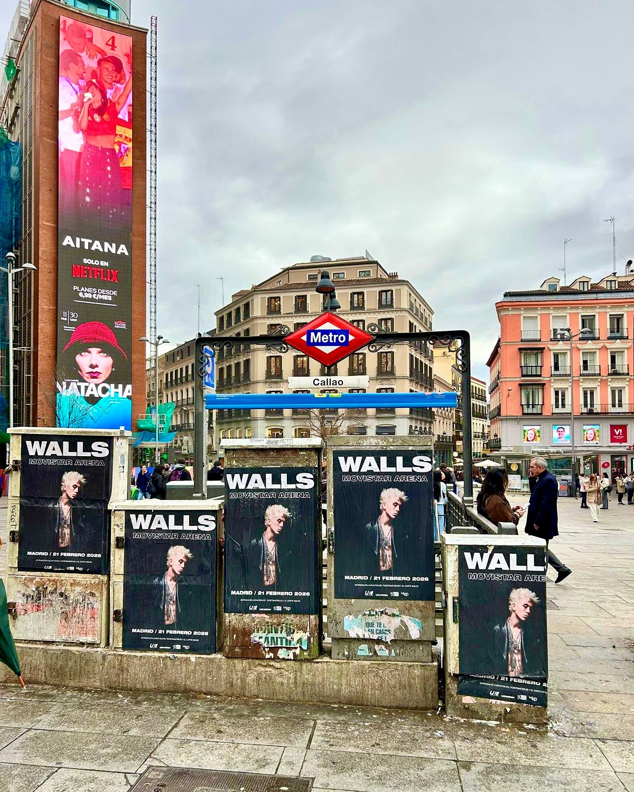

Quand un artiste comme Walls annonce un concert au Movistar Arena, nous savons qu'il faut bouger. Cette fois, nous avons préparé une **pose d'affiches** dans une station de métro de Madrid pour que personne ne rate le rendez-vous. Le résultat a été un déploiement de publicité extérieure qui a transformé les couloirs en un avant-goût du show.

## Une pose d'affiches qui ne passe pas inaperçue

La campagne s'est concentrée sur l'environnement du métro, un espace de passage constant. Nous avons placé les affiches sur les murs de la station, en profitant du flux de voyageurs. L'objectif ? Que chaque personne qui passait par là voie le nom de Walls et les dates du concert avant de rentrer chez elle.

C'est ce qui rend le **street marketing** spécial en tant que technique : il transforme le trajet quotidien en une rencontre avec la musique. Personne n'a besoin de chercher l'annonce ; l'annonce trouve le piéton.

## Un show qui promet d'être inoubliable

Walls revient sur scène après le succès de son premier album, et il le fait avec un show qui mélange la pop actuelle avec des rythmes urbains. Le rendez-vous est le 21 février 2026 au Movistar Arena de Madrid. Les places sont déjà en vente chez Live Nation, Ticketmaster et El Corte Inglés, et il ne reste que les dernières.

Notre pose d'affiches devait être à la hauteur de ce moment. C'est pourquoi chaque affiche a été placée avec précision, en cherchant la visibilité maximale dans la station. Il ne s'agit pas seulement de coller du papier ; il s'agit de créer un parcours visuel qui accompagne le spectateur jusqu'au jour du concert.

## Pourquoi le street marketing fonctionne pour les concerts

Pourquoi avons-nous misé sur le street marketing pour lancer un concert ? La réponse est simple : parce que ça fonctionne. Ce type de publicité extérieure génère un impact direct sur le public qui se déplace dans la ville. De plus, la pose d'affiches permet d'atteindre un public très varié, de l'étudiant qui va en cours au travailleur qui sort du bureau.

Voici quelques-uns des avantages que nous avons vus en choisissant cette campagne :

- Visibilité 24/7 dans une zone à fort trafic.
- Coût ajusté par rapport à d'autres supports publicitaires.
- Impact direct sur les personnes qui se déplacent dans la ville.
- Une finition esthétique qui attire l'attention sans être invasive.

En définitive, la pose d'affiches pour le concert de Walls au Movistar Arena a été un pari sûr. Et nous, ravis d'avoir fait partie d'un projet aussi enthousiasmant.
