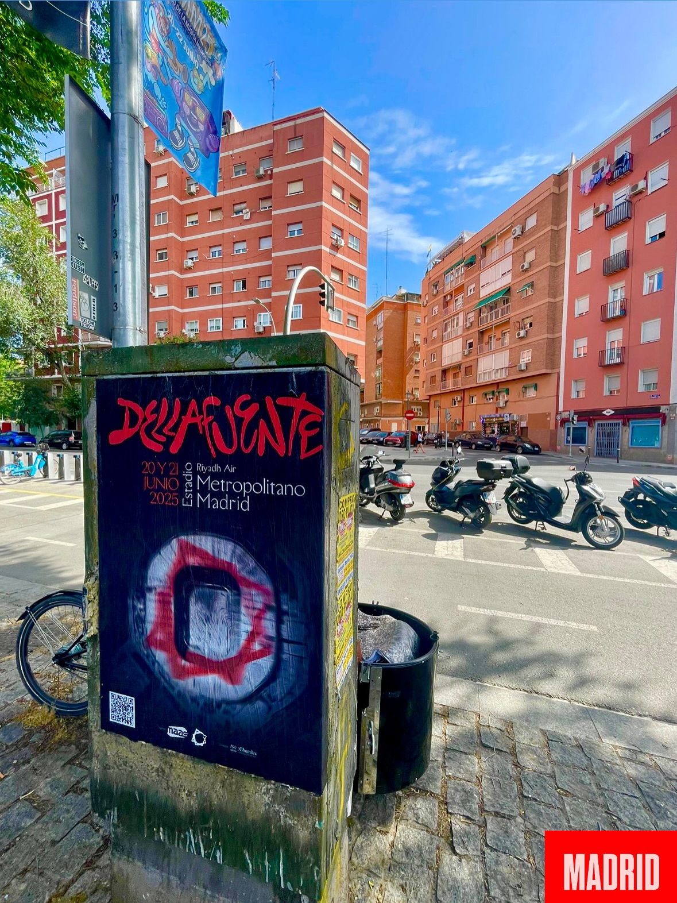

Dellafuente revient à Madrid et la ville le sait déjà. L'artiste grenadin atterrit dans la capitale avec deux dates, les 20 et 21 juin au Riyadh Air Metropolitano, après le succès de son album *«Torri Yama»*. Pour que l'annonce parvienne à tout le monde, la campagne de **collage d'affiches** est sortie dans la rue et s'est installée sur les supports où passent le plus de gens.

## Une campagne pensée pour deux grandes soirées

Une affiche est la première chose que voit quelqu'un qui marche sur le trottoir ou qui attend à un arrêt. C'est pourquoi, quand il y a un concert avec les dernières places en vente et deux dates consécutives, le wild posting devient l'outil le plus direct qui existe. Il n'y a ni algorithme ni scroll : il est là, juste devant ton nez.

Sur l'image, on voit la pièce montée sur sa structure, avec le message du concert bien visible et rien autour qui ne distraie. C'est l'objectif : qu'en deux secondes tu comprennes que Dellafuente joue au Metropolitano et qu'il reste des places.

## Comment se réalise un collage d'affiches

Chaque campagne a son parcours, mais le processus suit toujours le même chemin :

1. Étude des zones et des supports qui correspondent le mieux au public de l'artiste.
2. Impression des affiches avec l'art transmis par le client.
3. Collage par roulement, en profitant des heures de moindre affluence pour ne déranger personne.
4. Vérification le lendemain pour s'assurer que tout est toujours en place.

C'est un travail qui paraît simple et qui ne l'est pas. Il faut respecter les règles de chaque support, soigner la pose et refaire la tournée quand c'est nécessaire. Le **collage d'affiches** bien fait ne se remarque pas : on voit le message, c'est tout.

## Pourquoi le street marketing fonctionne ici

- Impact dans la rue, là où vit le public de l'artiste.
- Message clair, sans bruit autour.
- Présence dans la ville avant l'événement.
- Souvenir immédiat : nom, date et salle.

Le **street marketing** sert à ça, à mettre un événement dans la tête des gens sans leur demander la permission. Et dans un cas comme celui-ci, avec un artiste qui remplit deux soirées consécutives au Riyadh Air Metropolitano, c'est exactement ce qu'il faut.

Nous travaillons avec des supports urbains, avec des parcours réfléchis et avec des équipes qui collent vite et bien. Peu importe s'il s'agit d'un concert, d'un lancement ou d'une tournée : si tu veux que Madrid le sache, ça fonctionne.

Tu as quelque chose de similaire en cours ? Écris-nous et nous te racontons comment nous le porterions dans la rue.