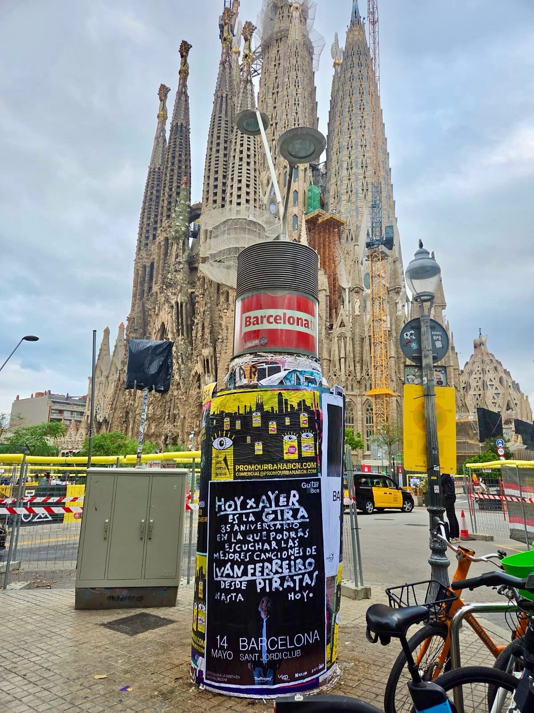

Barcelone se prépare pour une grande soirée. Iván Ferreiro célèbre ses 25 ans de carrière avec la tournée *«Hoy x ayer»*, et le Palau Sant Jordi sera l'une des étapes, le 14 mai 2026. Pour l'annoncer, nous avons réalisé un **collage d'affiches** dans la ville.

## Une colonne avec le message juste

Si tu regardes l'image, voilà le travail : une colonne publicitaire en pleine rue avec l'affiche de la tournée. On y voit le nom de l'artiste, celui de la tournée, la date et la salle. Il n'en faut pas plus.

C'est là le point fort de ce format. Pas de scroll, pas de bouton pour passer, aucun moyen de l'esquiver. Il y a une rue, des gens qui vaquent à leurs occupations et une affiche qui reste en tête sans demander la permission. Beaucoup de gens la lisent, la commentent avec la personne à côté et vont même jusqu'à la photographier.

## Comment se prépare un collage d'affiches

Derrière une action comme celle-ci, il y a un travail qui ne se voit pas. D'abord, on étudie le message : ce que doit comprendre quelqu'un qui passe devant en deux secondes. Ensuite, on prépare l'impression et on choisit les supports où l'affiche va cohabiter avec le quotidien de la ville, comme les colonnes publicitaires.

Quelques clés que nous suivons toujours :

- Un message clair : artiste, tournée, date et lieu.
- Un design qui se lise de loin et d'un seul coup d'œil.
- Des supports dans des zones de passage, où il y a des gens qui entrent et sortent toute la journée.
- Une cohérence avec le reste de la campagne, tant sur les réseaux que sur le site web de billetterie.

## Pourquoi le **street marketing** s'accorde avec la musique en direct

Le street marketing ne concurrence pas le digital : il l'accompagne. Pour un concert comme celui-ci, la rue fait un travail qu'aucune publicité à l'écran ne fait de la même manière. Le message parvient à des gens qui vivent ou passent à Barcelone chaque jour, et celui qui passe devant plusieurs fois voit l'affiche encore et encore. C'est ce souvenir qui fait ensuite que, lorsque tu vois la date sur les réseaux, le nom te dit déjà quelque chose.

## De la rue au Palau Sant Jordi

Le collage d'affiches sert à quelque chose de très concret : que tu n'oublies pas la date. Iván Ferreiro passe en revue dans *«Hoy x ayer»* les hymnes qui ont marqué plusieurs générations, de Los Piratas à sa musique la plus récente. C'est une tournée anniversaire, de celles qui se vivent une fois.

Si tu veux être là, les billets sont disponibles sur Guitarbcn.com. Et si tu te promènes à Barcelone ces jours-ci, tu sais déjà où regarder : la rue te le dit avant tout le monde.
