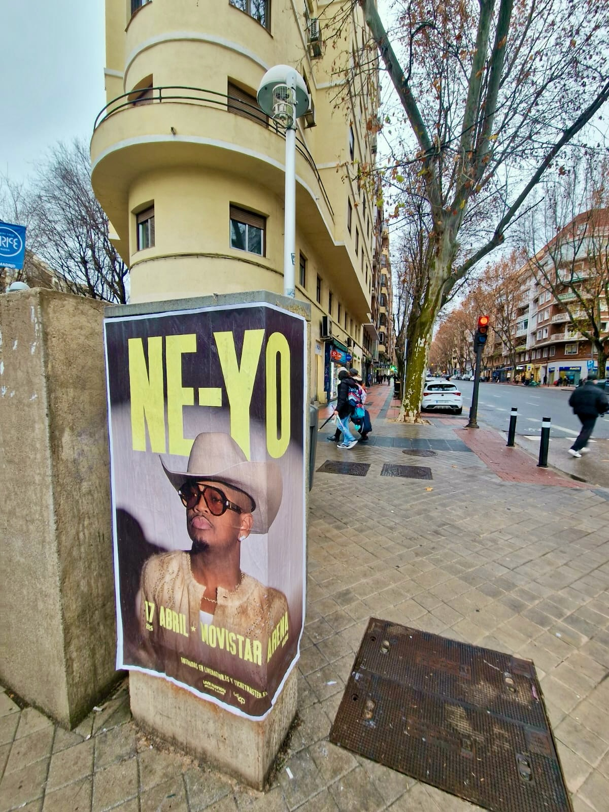

Il y a des campagnes qui se comprennent mieux dans la rue et celle-ci en fait partie. NE-YO arrive à Madrid le 17 avril et le Movistar Arena sera le point de rencontre pour les fans de R&B. Pour que la nouvelle arrive dans la rue, nous avons réalisé un **collage d'affiches** à Madrid avec le concert comme protagoniste : une affiche avec son visage, son chapeau et des lettres énormes qui vit maintenant à un coin de la ville, sur une structure en béton par laquelle passent des gens chaque jour. Le **street marketing** a cela : il apparaît là où personne ne l'attend et aucun bloqueur de publicité ne peut l'arrêter.

## Une affiche qui dit tout

La pièce montre l'artiste en gros plan, avec son nom en grand et la date bien claire sous l'image : 17 avril, Movistar Arena. En bas apparaissent les liens pour obtenir des billets, livenation.es et ticketmaster.es. Le contraste entre le fond sombre et la typographie claire fait que l'affiche se lit de loin, un élément clé lorsque le support est dans une rue avec du trafic et des gens qui marchent. Sur la photo, on voit le résultat : l'affiche collée sur cette structure en béton à un coin, avec des arbres et des bâtiments autour, dans une zone de passage.

## Pourquoi ce format continue de fonctionner

Le collage d'affiches continue d'avoir du sens pour des événements comme celui-ci pour plusieurs raisons :

- Il se voit sans qu'on le cherche : personne n'a besoin de cliquer pour tomber sur l'annonce.
- Il atteint des zones de la ville où le public circule quotidiennement : rues, coins de rue et points de passage.
- Il renforce le message s'il est répété à plusieurs endroits pendant la campagne.
- Il génère du contenu : chaque support peut être photographié et partagé sur les réseaux.

## Comment nous travaillons chaque campagne

1. Nous cherchons des supports disponibles dans des zones de passage et adaptons le message au public de l'événement.
2. Nous produisons les affiches avec des matériaux qui résistent aux intempéries.
3. Nous collons aux horaires qui dérangent le moins et avec les autorisations en règle.
4. Nous vérifions le résultat et le documentons avec des photos comme celle qui accompagne ce post.

Si vous avez un concert, un festival ou un lancement et que vous voulez que la ville le sache, écrivez-nous. Nous nous chargeons de la production, du collage et du reportage photo pour que votre campagne se voie comme elle le mérite.
