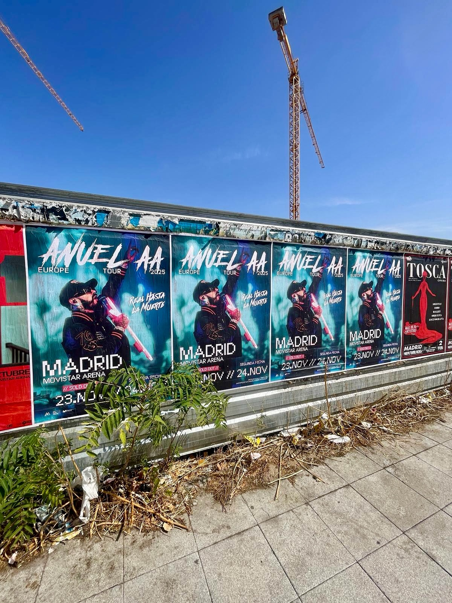

Anuel AA arrive à Madrid, et il le fait avec deux dates au Movistar Arena. La première, le 23 novembre, a affiché complet, alors une deuxième a été ouverte pour le 24. Pour que cette annonce arrive dans la rue, nous avons réalisé un **collage d'affiches** dans la ville avec toutes les informations de la tournée *«Europe Tour 2025»*.

## Une affiche qui raconte tout en deux secondes

Quand on annonce un concert, l'affiche doit répondre à trois questions : qui vient, quand et où s'achète le billet. Dans ce cas, le design incluait :

- Le nom de l'artiste et celui de la tournée, *«Europe Tour 2025»*.
- Les dates au Movistar Arena, avec le 23 novembre déjà complet.
- L'annonce de la deuxième date disponible, le 24 novembre.
- Les sites de vente de billets : Enterticket.es et anueleuropetour.es.

Avec ça, l'affiche travaille toute seule. Pas besoin d'expliquer autre chose : celui qui la voit sait déjà quoi faire. La tournée se présente en plus avec *«Real hasta la muerte»* comme bannière, quelque chose qui connecte directement avec les fans de l'artiste.

## Comment se travaille le collage d'affiches à Madrid

Ce type de campagne ne consiste pas à coller des affiches pour coller des affiches. Il s'agit d'apparaître là où il y a du monde. C'est pourquoi le travail s'organise ainsi :

1. On choisit des points de la ville où il y a du passage.
2. On répète le message pour que le nom et les dates restent en tête.
3. On soigne le format et l'emplacement pour que l'affiche soit bien visible et résiste.
4. On respecte toujours les espaces et la réglementation de chaque zone.

Le résultat est une campagne qui se voit dans la rue, dans le métro, aux arrêts et dans les endroits où les gens se déplacent au quotidien. C'est du **street marketing** à l'état pur : message clair, support physique et répétition.

## Pourquoi cela fonctionne pour un concert

La musique live s'achète par impulsion, et l'impulsion naît de voir. Une affiche avec le visage de l'artiste, la ville, la salle et les sites de vente génère cette première impulsion. Ensuite, le fan cherche le lien et achète.

Dans ce cas, la réponse n'a pas tardé : la date du 23 novembre a affiché complet et une deuxième a été ouverte pour le 24, également au Movistar Arena. Les billets peuvent s'acheter sur Enterticket.es et sur anueleuropetour.es.

Si tu as un concert, un événement ou un lancement et que tu veux que la ville le sache, le collage d'affiches reste l'une des façons les plus directes d'y parvenir. Ça se voit, ça se retient et ça se partage.