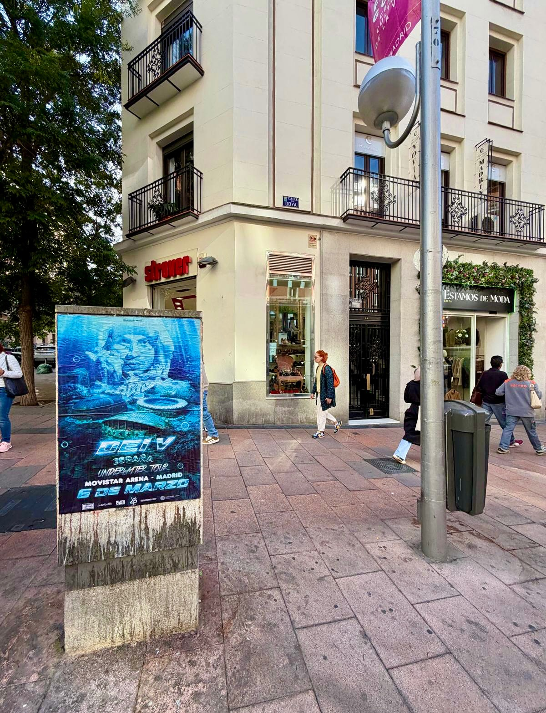

Quando un artista conferma delle date in Spagna, la prima impressione non arriva sul cellulare: arriva in strada. È esattamente quello che cerchiamo con ogni campagna di **affissione manifesti**, e questa volta il protagonista è stato DEI V, con tre tappe distribuite nel paese.

## Tre città, tre date e un unico manifesto

L'annuncio doveva suonare forte allo stesso modo in ogni piazza, così il messaggio è stato ripetuto nei tre punti del tour:

- 6 marzo al Movistar Arena, Madrid.
- 7 marzo al Live Sur Stadium, Siviglia.
- 9 marzo al Palau Sant Jordi, Barcellona.

Il richiamo era chiaro: immergersi nell'universo *"Underwater"*. Un concetto visivo potente, con quel tocco di mistero e d'acqua che chiedeva a gran voce di essere visto in strada e non solo su uno schermo.

## Cosa abbiamo fatto in strada

Abbiamo montato i manifesti su supporti rettangolari, in formato verticale, con il design dell'artista e le informazioni del manifesto: città, venue e date. L'obiettivo era che chiunque passasse davanti capisse l'annuncio in due secondi, senza doverlo leggere due volte.

Qui non ci sono pulsanti né algoritmi che tengano. Quello che c'è è una città piena di gente che cammina, va al lavoro o torna a casa. Per questo il **street marketing** continua a funzionare altrettanto bene per annunciare i tour:

- L'impatto è fisico: il manifesto lo incontri, non lo salti.
- Genera conversazione: la gente lo fotografa e lo condivide.
- Rafforza la presenza in città prima del concerto.
- Permette di ripetere il messaggio in più punti contemporaneamente.

## Un linguaggio unico per tre città diverse

Madrid, Siviglia e Barcellona hanno ritmi diversi, ma il manifesto era lo stesso. È quella ripetizione che fa sì che l'annuncio ti rimanga in testa: vederlo a un angolo, poi a un altro e finire per associare il volto dell'artista alla data del concerto.

Per un tour che passa da tre grandi venue in appena pochi giorni, la strada diventa la migliore vetrina. E l'affissione manifesti, il modo più diretto di avvisare tutti che i biglietti sono disponibili.

Se hai un concerto, un evento o un lancio e vuoi che la città lo sappia, scrivici. Ci occupiamo della produzione e della collocazione della campagna.
