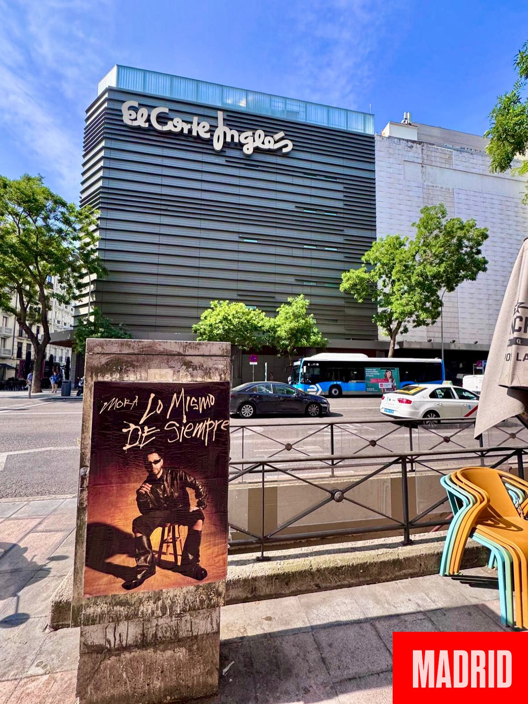

Quando un artista come Mora pubblica un album, la strada diventa la migliore vetrina. Per questo, per celebrare l'uscita di *"Lo Mismo de Siempre"*, abbiamo organizzato un'**affissione di manifesti** che ha portato il suo nome a Madrid, Barcellona e Siviglia. L'idea era semplice: che il lancio si vedesse, si sentisse e si ascoltasse nel posto più diretto possibile, la via pubblica.

Questo progetto di **street marketing** non si limita ad attaccare un poster. Consiste nello scegliere bene dove, quando e come farlo affinché il messaggio arrivi alle persone nella loro vita quotidiana. E con un artista del calibro di Mora, l'obiettivo era ancora più chiaro: fare in modo che il suo nuovo album fosse presente nel paesaggio urbano fin dal primo giorno.

## Il quinto album di Mora è già in strada

Mora torna alla grande con *"Lo Mismo de Siempre"*, un lavoro di 17 canzoni in cui combina la sua essenza con nuovi suoni. Il disco include collaborazioni di C. Tangana, Young Miki, Sech e Ryan Castro, ed è già disponibile su tutte le piattaforme. Per celebrarlo, abbiamo tappezzato Madrid, Barcellona e Siviglia con il suo nome. Non c'è bisogno di spiegare molto altro: il nome di Mora era ovunque.

Con 17 canzoni, Mora dimostra di restare fedele al suo stile, ma anche di saper rischiare con nuovi suoni. Le collaborazioni con C. Tangana, Young Miki, Sech e Ryan Castro sono una buona prova di questa miscela. L'album è già disponibile su tutte le piattaforme, quindi l'azione di strada è arrivata nel momento giusto: quando i suoi fan cominciavano ad ascoltarlo.

## Com'è andata l'affissione di manifesti

L'affissione di manifesti è stata il pezzo chiave della strategia. Abbiamo lavorato in più città contemporaneamente e coordinato un'azione che ha trasformato i muri nel miglior altoparlante del lancio. L'obiettivo era che chiunque passeggiasse per strada si imbattesse nel disco senza cercarlo.

Inoltre, l'azione è stata fatta in tre città contemporaneamente, il che moltiplica la portata del lancio. Non è lo stesso annunciare un disco in un solo posto che renderlo presente a Madrid, Barcellona e Siviglia allo stesso tempo.

Questo è ciò che ha incluso l'azione:
- Affissione di manifesti con il nome di Mora a Madrid, Barcellona e Siviglia.
- Una campagna di street marketing pensata per generare impatto visivo nell'ambiente urbano.
- Visibilità diretta per *"Lo Mismo de Siempre"* in piena strada.

## Perché la strada continua a essere il miglior palcoscenico

Un lancio musicale ha bisogno di qualcosa in più che essere disponibile sulle piattaforme. Con questa azione, Mora non è solo nelle classifiche digitali, ma anche sui muri delle città. L'affissione di manifesti genera una connessione diretta con il pubblico e trasforma l'uscita in un evento visivo.

Così, quando qualcuno vede il manifesto, la prima cosa che fa è cercare il disco. Ed è esattamente quello che cercavamo con questa campagna di street marketing: che l'uscita di *"Lo Mismo de Siempre"* si vivesse in strada e si portasse ovunque.
