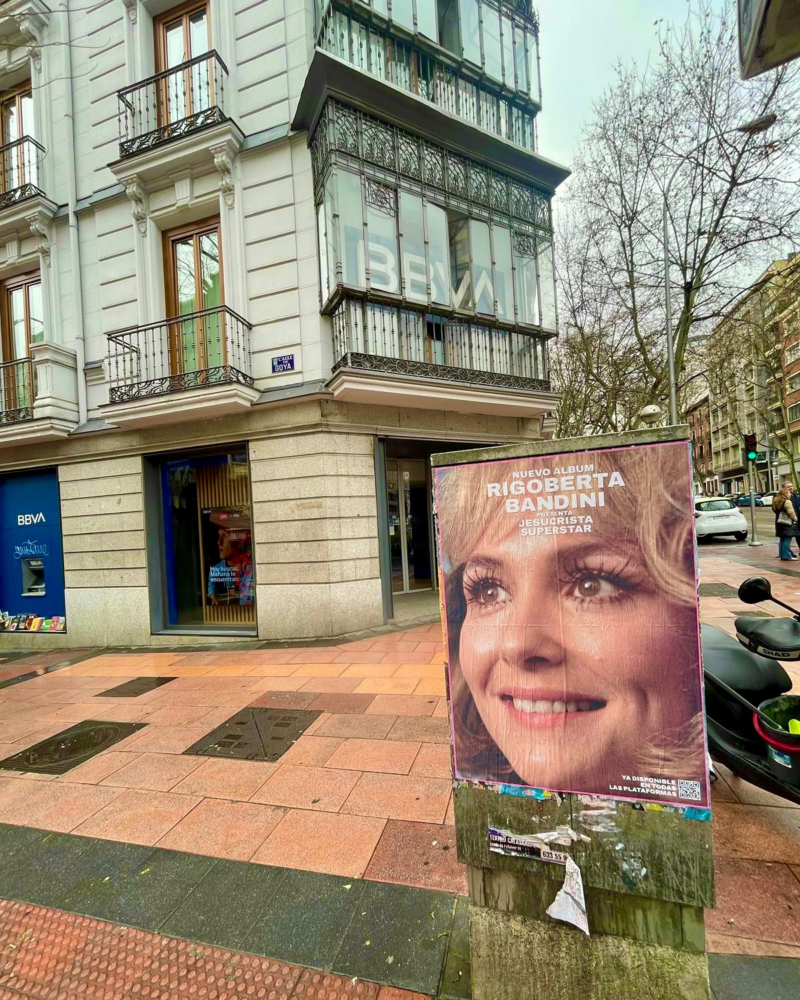

Quando Rigoberta Bandini ha annunciato il suo nuovo lavoro, sapevamo che dovevamo essere all'altezza. L'album, intitolato *«Jesucrista Superstar»*, è già disponibile su tutte le piattaforme digitali, e noi abbiamo fatto in modo che anche la città lo sapesse. Ecco come lo abbiamo fatto.

## Una campagna di affissione di manifesti che non passa inosservata

Il nostro team si è messo al lavoro per progettare un'azione di **affissione di manifesti** che riflettesse l'essenza del disco: emozione, ironia e magia. Con 22 canzoni che mescolano tutto questo, il manifesto doveva essere potente quanto il contenuto dell'album. E ci siamo riusciti.

Abbiamo posizionato i manifesti in punti strategici della città, cercando sempre l'impatto visivo e la vicinanza con il pubblico. Non si tratta solo di attaccare un poster, ma di creare un'esperienza urbana che inviti la gente a guardare, a fermarsi e, soprattutto, ad ascoltare il disco.

- Supporti in zone ad alto traffico pedonale.
- Design che giocano con l'estetica dell'album e il suo titolo.
- Integrazione con l'ambiente urbano per massimizzare la visibilità.

## Un album che chiedeva a gran voce lo street marketing

*«Jesucrista Superstar»* non è un lancio qualsiasi. Con collaborazioni di artisti come Luz Casal e Juliana Gattas, il disco ha un mix di voci e stili che meritava una campagna all'altezza. Per questo, lo **street marketing** è stato la scelta perfetta: la strada è il palcoscenico ideale per un progetto così rivoluzionario.

La risposta del pubblico non si è fatta attendere. I manifesti hanno generato conversazione, curiosità e voglia di scoprire cosa ci fosse dietro a quel titolo così accattivante. E mentre la gente correva ad ascoltare l'album sulle piattaforme digitali, noi stavamo già pensando alla prossima campagna.

Se hai un progetto che ha bisogno di uscire in strada, sai già come lavoriamo. L'affissione di manifesti continua a essere uno dei modi più diretti ed efficaci per connettersi con la gente. E a noi piace tantissimo farlo.
