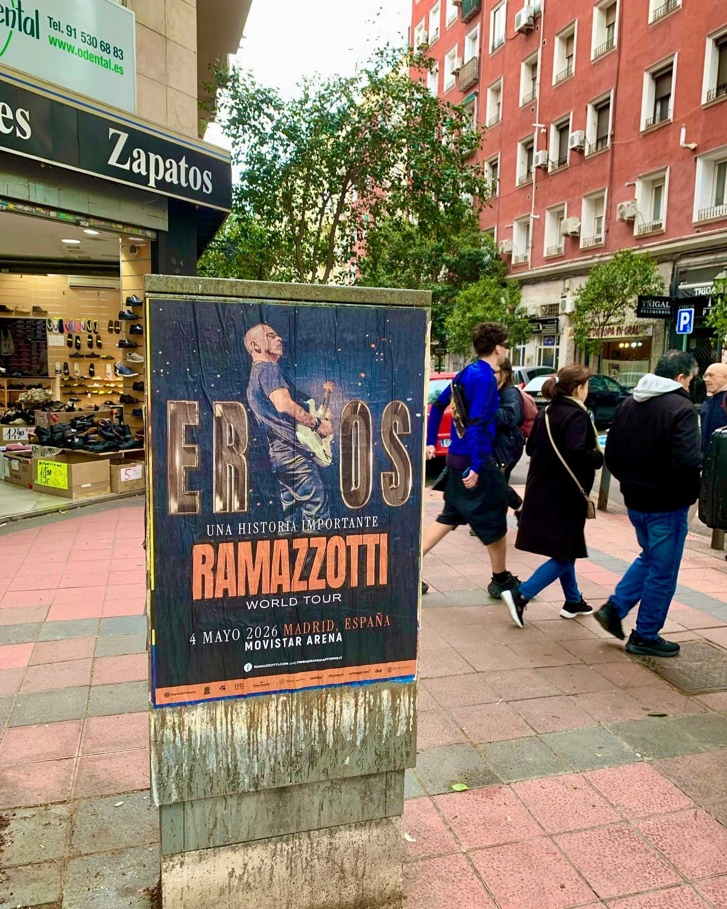

Il ritorno dei grandi artisti sui palchi richiede sempre una strategia di diffusione chiara e visibile a livello stradale. In questa occasione, abbiamo lavorato alla diffusione del concerto dal vivo di Eros Ramazzotti a Madrid, che si esibirà al Movistar Arena il 4 maggio 2026 nell'ambito del suo tour *"Una historia Importante World Tour"*.

## Visibilità urbana a livello stradale

Affinché un evento di questa portata entri in contatto con le persone, la presenza nell'ambiente quotidiano è fondamentale. Attraverso l'**affissione di manifesti** su supporti e arredo urbano posizionati strategicamente, facciamo sì che l'appuntamento musicale sia presente nella vita di tutti i giorni dei pedoni. In zone affollate, accanto ai negozi e strade ad alto traffico pedonale, l'immagine del concerto cattura immediatamente l'attenzione di chi cammina per la zona.

## Una campagna chiara per informare i fan

Le azioni promozionali nello spazio urbano offrono un impatto diretto che integra perfettamente la comunicación sui social network. Il manifesto pubblicitario mostra in modo pulito e diretto le informazioni chiave dello show affinché nessuno rimanga senza il proprio biglietto:

- Artista: Eros Ramazzotti
- Tour: *"Una historia Importante World Tour"*
- Data: 4 maggio 2026
- Luogo: Movistar Arena, Madrid

## Perché puntare sulle azioni di strada

Lo **street marketing** permette ai concerti e agli eventi culturali di integrarsi in modo naturale nella routine del pubblico di riferimento. Una buona affissione di manifesti genera conversazione e ricorda ai fan che i biglietti sono già in vendita. Se desideri che il tuo prossimo tour o evento abbia un impatto reale nelle strade della città, mettiti in contatto con noi e ideeremo la campagna adatta al tuo progetto.