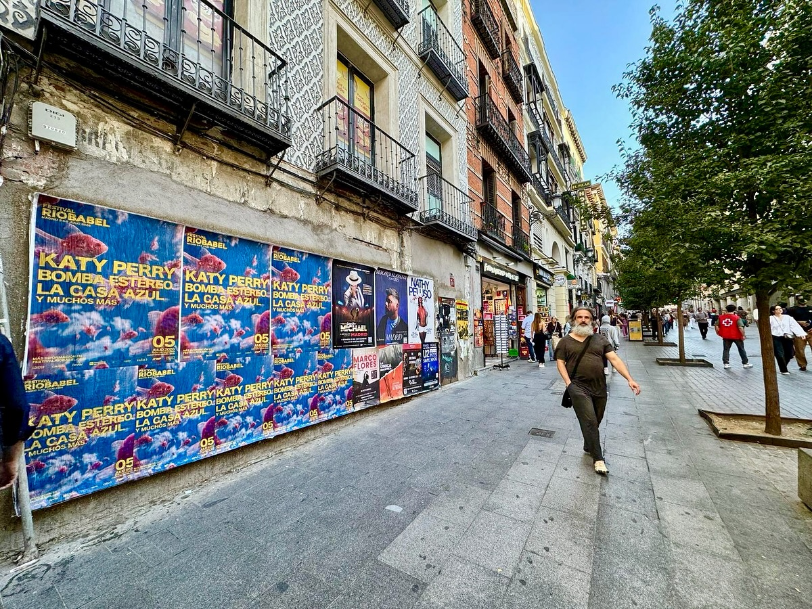

Madrid ha già un piano per l'estate. Il festival *"Río Babel 2026"* arriva il 3, 4 e 5 luglio 2026 con un cartellone che porta Katty Perry, Bomba Estéreo, La casa Azul e molti altri artisti. E perché la notizia esca dal telefono e arrivi in strada, abbiamo fatto l'**affissione manifesti** della campagna a Madrid.

## I manifesti sono già in strada

La foto della campagna lo dice chiaramente: strada pedonale, architettura europea, luce del giorno e cielo sereno. Questo è lo scenario in cui compaiono i manifesti del festival. Un posto dove la gente passa a piedi, senza fretta, e dove un manifesto ben affisso si vede da lontano e rimane in testa.

Qui sta il bello. Nessuno deve cercare nulla: il messaggio appare davanti. Chi passa per strada si imbatte nel nome del festival, nelle date e negli artisti. Tutte le info a colpo d'occhio: dal 3 al 5 luglio 2026 e il sito festivalriobabel.com per saperne di più.

## Cosa c'è dietro un'affissione di manifesti

Affiggere manifesti per strada sembra facile, ma ha il suo lavoro. Prima di affiggere qualsiasi cosa bisogna decidere dove, e per farlo bisogna pensare alla gente: da dove passa, a che ora e dove guarda.

Il processo, a grandi linee, è questo:

- Scegliere le strade e i punti con più passaggio di gente.
- Preparare i manifesti con il formato e il materiale che resistono all'esterno.
- Affiggerli bene, con un prodotto che non si stacchi al primo giorno di sole o di pioggia.
- Ripassare per verificare che siano ancora al loro posto e in buono stato.

È un lavoro di strada, di quelli di sempre. Per questo la pubblicità esterna continua a funzionare quando si fa bene.

## Perché lo street marketing si sposa con i festival

Un festival si gioca molto nelle settimane precedenti. La gente decide se andare o no, e lo decide per strada, camminando o aspettando. Ecco dove entra lo **street marketing**: mettiamo il messaggio dove sta il pubblico, senza che debba andarlo a cercare.

E funziona meglio quando va di pari passo con il digitale. Il manifesto dà il primo avviso, con il nome del festival e le date. Poi, chi vuole più dettagli va su festivalriobabel.com e lì trova tutto. La strada aggancia e il sito chiude il lavoro.

In questo caso, inoltre, il manifesto parla da solo: Katty Perry, Bomba Estéreo o La casa Azul sono nomi che attirano l'attenzione di chiunque passi davanti. Questa è la spinta di cui ha bisogno un evento così.

Se hai un festival, un concerto o un evento da annunciare, una campagna di manifesti ben pensata ti mette davanti a molta gente. Raccontaci di cosa hai bisogno e montiamo la tua.
