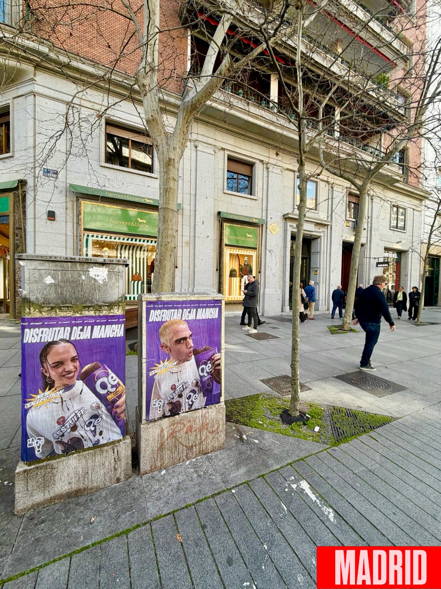

Ci sono campagne che si capiscono appena le vedi sul marciapiede. La collaborazione tra Qé e Ssstufff ha già lasciato la sua macchia in diverse città della Spagna, e a Madrid l'azione si vede così com'è: due manifesti di grande formato su supporti di pietra, in piena strada, con il motto *"Disfrutar deja mancha"* che presidia ogni pezzo.

## Due manifesti, un motto e una città

I pezzi sono su fondo viola e mostrano i protagonisti della campagna con il capo di Ssstufff indosso e il prodotto di Qé in mano. Il motto compare in alto, in grande, e il resto lo fa il contesto: vetrine, alberi, gente che cammina e un viavai costante di pedoni che non può fare a meno di guardare.

Questo è il punto. Non serve un grande spiegamento per attirare l'attenzione: serve essere dove la gente passa, nel momento in cui passa. E questo, in una via commerciale, si nota.

## L'**affissione manifesti** come vetrina di una collezione

Quando un marchio lancia una nuova collezione, la strada è la prima vetrina che molta gente vede. L'**affissione manifesti** permette di occupare quello spazio con un formato che non si può chiudere, né saltare, né silenziare. È lì, all'altezza dello sguardo, mentre la gente va per i fatti suoi.

In questo caso, la campagna assolve a diverse cose contemporaneamente:

- Fa conoscere la collaborazione tra Qé e Ssstufff in diverse città del paese.
- Annuncia che la nuova collezione è già disponibile online e nei negozi di Ssstufff.
- Porta il motto *"Disfrutar deja mancha"* su un supporto fisico, in un contesto urbano reale.
- Rafforza l'immagine dei due marchi con una presenza ripetuta in punti diversi.

Tutto questo senza invadere, senza disturbare e senza che il pedone debba fare altro che alzare lo sguardo.

## Perché lo **street marketing** si adatta a un marchio di abbigliamento urbano

Lo **street marketing** funziona quando il messaggio e il luogo in cui viene collocato hanno qualcosa in comune. Qui ce l'hanno: una collezione di stile urbano annunciata nella strada stessa, con manifesti che fanno parte del paesaggio della città. La gente non lo vede come pubblicità intrusiva, ma come qualcosa che era già lì.

Inoltre, questo tipo di azioni si adattano bene a lanci che necessitano di una presenza rapida e diffusa:

1. Si scelgono ubicazioni con un alto transito pedonale.
2. Si installano i pezzi su supporti urbani già esistenti.
3. Si ripete il messaggio in diverse città per ampliare la portata.
4. Si mantiene lo stesso linguaggio visivo in tutti i punti.

Il risultato è una campagna coerente, visibile e facile da riconoscere, dovunque si trovi il manifesto.

## Quello che lascia questa azione

La collaborazione tra Qé e Ssstufff si può già vedere in strada, e anche online e nei negozi di Ssstufff, dove la nuova collezione è disponibile. Per noi, il lavoro è consistito nel portare quel messaggio nello spazio pubblico con un'esecuzione curata, ripetuta e adattata a ogni città.

Se hai un lancio tra le mani e vuoi che la gente lo veda appena esce di casa, la strada resta un buon posto da cui iniziare. Scrivici e ti raccontiamo come lo organizziamo.
