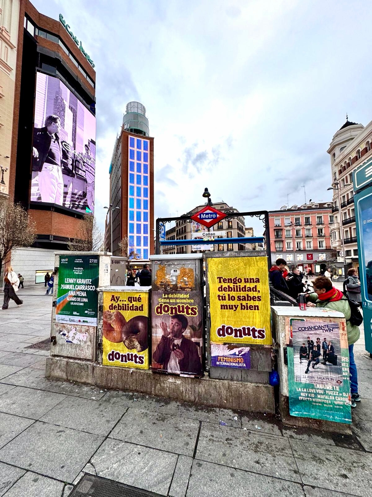

Ci sono voglie che non si pensano, semplicemente si sentono. Con questa idea, Donuts è scesa in strada a Madrid e Barcellona e ha riempito la città di tentazioni. Noi ci siamo occupati dell'**affissione manifesti**, quella parte del lavoro che non si vede sui social ma che fa arrivare il messaggio a chi cammina, aspetta la metro o attraversa la piazza.

## Una debolezza confessata in strada

Il messaggio era diretto: *"Tengo una debilidad, tú lo sabes muy bien"*. Così apparivano i manifesti, con il giallo del marchio a dominare e i donuts come protagonisti. In uno dei soggetti si vedeva un uomo con un donut in mano, con quell'aria di annuncio di un'altra epoca. In un altro, i donuts stessi bastavano. Niente giri di parole: il marchio si presenta, confessa la sua debolezza e lascia che chi passa completi la frase.

I cartelloni hanno condiviso lo spazio con altre programmazioni e avvisi della città, una cosa normale in questi supporti. Ed è lì che sta parte del merito: distinguersi fra tutto il resto.

## Madrid e Barcellona, due piazze con molta gente

La campagna si è fatta vedere in entrambe le città. A Madrid, per esempio, è stata in punti con molto transito come la zona di Callao, con la bocca della metro e gli schermi accanto. Anche Barcellona è entrata nella distribuzione.

Cosa apporta questo tipo di azione:

- Impatto ripetuto: il messaggio si vede più volte al giorno sullo stesso percorso.
- Vicinanza: il manifesto è all'altezza dello sguardo, non su uno schermo che si ignora.
- Copertura locale: si scelgono zone con passaggio di gente e si ripete la presenza.
- Ricordo di marca: un colore e una frase breve restano in testa.

## Perché lo street marketing continua a funzionare

La pubblicità digitale raggiunge molti, ma si salta con il pollice. Lo **street marketing** fa il contrario: occupa la strada, dove la gente guarda per forza. Un'affissione manifesti ben fatta è un modo economico di essere presenti in città e di generare conversazione, perché la gente fotografa ciò che le attrae e lo condivide.

Se hai una campagna in mente e vuoi che si veda in strada, possiamo aiutarti. Lavoriamo l'affissione manifesti in diverse città e ci occupiamo che il tuo messaggio arrivi dove deve arrivare.