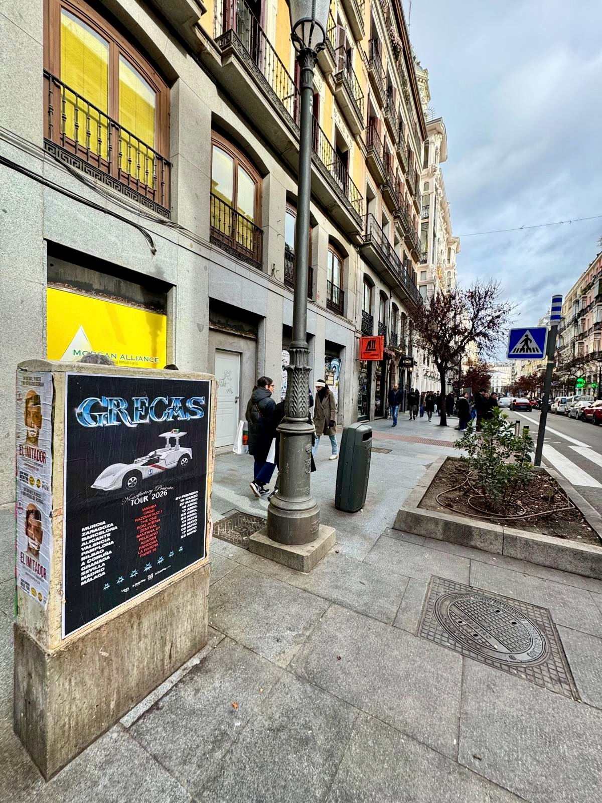

Quando un artista lancia un lavoro potente e prepara una serie di concerti, essere presente per strada fa la differenza. In questa occasione, ci siamo occupati dell'**affissione manifesti** per annunciare l'arrivo sui palchi dell'ultimo disco dei Grecas, intitolato *«Escrito en la M-30»*. Con una strategia chiara di **street marketing**, abbiamo portato l'immagine del gruppo e tutte le informazioni del loro tour davanti agli occhi di migliaia di pedoni.

## Un percorso visivo per il *«Tour 2026»*

La campagna cerca di connettersi direttamente con il pubblico urbano che consuma musica dal vivo. Il design del manifesto, incentrato sull'universo visivo di *«Escrito en la M-30»*, mette in evidenza in modo chiaro le tappe confermate del loro *«Tour 2026»*, assicurando che i fan identifichino a colpo d'occhio quando e dove potranno vedere il gruppo dal vivo.

Tra le date e le città principali fissate nella cartellonistica si trovano:

- 27/03 - Sala Razzmatazz 1, Barcelona.
- 17/04 - Roig Arena, Valencia.
- 17/05 - Sala La Riviera, Madrid.
- Concerti programmati in altre piazze come Murcia, Zaragoza, Alicante, Pamplona, Bilbao, A Coruña, Granada, Sevilla o Málaga.

Posizionando le informazioni in punti strategici di passaggio, siamo riusciti a far sì che l'annuncio del tour entrasse negli occhi della gente mentre cammina per la città.

## Il valore della cartellonistica fisica nella promozione musicale

Anche se l'ambiente digitale è indispensabile oggi, l'affissione tradizionale di manifesti continua a offrire un impatto reale e difficile da ignorare. Un manifesto ben posizionato genera conversazione, rafforza l'immagine dell'artista e risveglia l'interesse immediato per l'acquisto dei biglietti.

Per tour con un'identità così definita come quella dei Grecas, la presenza esterna funziona come un altoparlante costante. Integrando i supporti nell'ambiente urbano quotidiano, il messaggio arriva in modo naturale e non invasivo agli amanti della musica, ai frequentatori abituali di concerti e a chi cerca programmi culturali.

## Fai crescere la visibilità del tuo prossimo progetto

Se hai tra le mani il lancio di un album, un tour nei locali, un festival o qualsiasi evento che debba raggiungere il grande pubblico, possiamo aiutarti. Progettiamo ed eseguiamo azioni su misura adattate alle esigenze di ogni cliente, garantendo che il tuo manifesto risplenda negli spazi adeguati. Contatta il nostro team per pianificare la tua prossima campagna esterna e fai in modo che il tuo messaggio risuoni forte e chiaro per strada.
