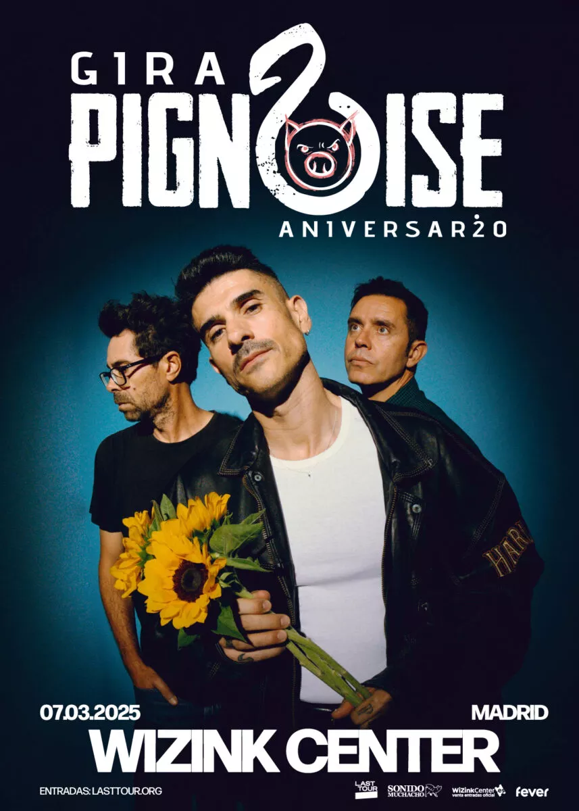

Pignoise è stata fondata a Madrid all'inizio di questo secolo e riunì Álvaro Benito (giocatore del Real Madrid, Getafe e della nazionale spagnola) e anche il calciatore Héctor Polo. A loro si  unì Pablo Alonso e immediatamente iniziarono a incidere dischi e a dare concerti.

Dopo «Melodías desafinadas» (2003) e «Esto no es un disco de punk» (2005), incisero il brano «Nada que perder» come tema musicale della serie televisiva spagnola «Los hombres de paco». Fu un grande successo.

Attualmente celebrano il loro 20° anniversario al WiZink Center di Madrid il prossimo 7 marzo 2025. E, come ormai consuetudine, abbiamo già iniziato ad affiggere i manifesti di promozione del concerto un anno prima dell'evento.

