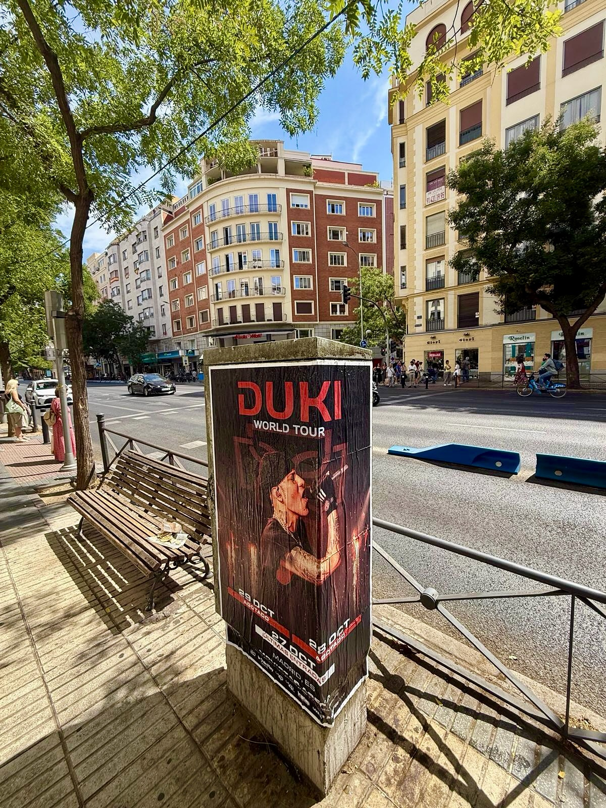

Duki continua a dimostrare la sua forza nella musica urbana e il suo nuovo tour fa tappa nella capitale. Dopo aver esaurito i biglietti per le sue prime due date al Movistar Arena, l'artista argentino ha aggiunto uno show per il 27 ottobre. Per comunicare questa data a tutti i suoi fan, siamo usciti in strada per realizzare l'**affissione manifesti** di questo grande evento.

## Il potere del formato fisico nell'ambiente urbano

Nonostante l'impatto dell'ambiente digitale, essere presenti nello spazio pubblico fa la differenza quando si promuove un grande concerto. Il manifesto ufficiale con l'immagine dell'artista e i dati del tour *«Ameri World Tour»* si distingue chiaramente nello spazio urbano madrileno.

Vedere il manifesto durante la routine quotidiana genera un impatto diretto sui pedoni. Mostrando messaggi chiari come le date esaurite e l'avviso di ultimi biglietti per il 27 ottobre, questa azione di **street marketing** genera l'urgenza necessaria perché il pubblico cerchi i suoi biglietti su livenation.es o ticketmaster.es.

## Elementi chiave della campagna

Una buona pubblicità esterna deve trasmettere le informazioni essenziali in pochi secondi. In questo caso, il design utilizzato per l'**affissione manifesti** si concentra sugli aspetti più rilevanti:

- Fotografia ufficiale di Duki sul palco.
- Menzione chiara del recinto: Movistar Arena a Madrid.
- Stato della biglietteria con avvisi di date esaurite e biglietti disponibili.
- Punti vendita ufficiali per ottenere i posti.

## Visibilità assicurata per il tuo prossimo show

Le azioni in strada sono l'opzione ideale per connettersi con le persone in modo reale e quotidiano. Se organizzi un concerto o qualsiasi evento e hai bisogno che il tuo messaggio raggiunga migliaia di persone in città, scrivici e organizziamo la tua campagna su misura.
