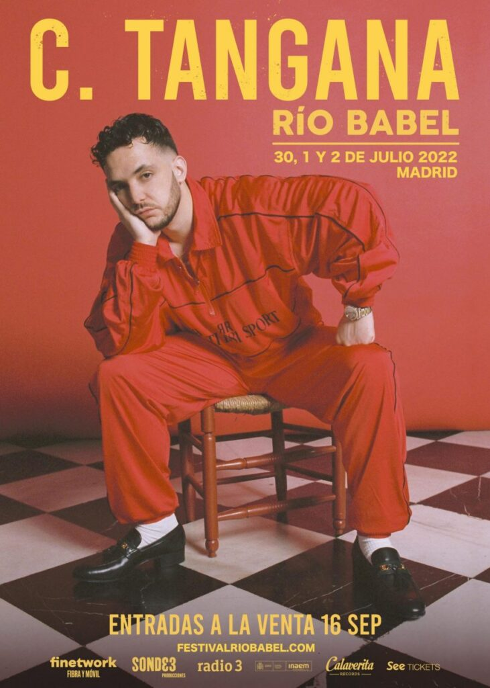

Il Festival Rio Babel 2022, che si terrà dal 30 giugno al 2 luglio alla Caja Mágica di Madrid, conta già tre headliner tra i più vari e con un innegabile richiamo popolare.

* Giovedì 30 giugno: Dani Martín
* Venerdì 1 luglio: C. Tangana
* Sabato 2 luglio: Residente

Gli abbonamenti si possono già acquistare sul sito ufficiale del festival a partire da 80 euro. Inoltre, se vuoi vedere Dani Martín al Río Babel 2022, c'è una quota di biglietti in offerta a 35 euro per quella giornata. Costa lo stesso il giorno di Residente, mentre quello di C. Tangana sale fino a 40 euro.

Dopo il successo ottenuto nel suo formato adattato, che ha riunito 40.000 spettatori allo Stadio Wanda Metropolitano durante una serie di concerti lo scorso mese di luglio, il Festival Río Babel tornerà nel 2022 con il suo formato originale.

Un ritorno atteso, in cui il festival madrileno cambia sede alla Caja Mágica. Crescendo così in dimensioni e capienza per questa nuova edizione, che si spera, finalmente, sia quella del ricongiungimento con la vecchia normalità.

> Il Festival Río Babel 2022 si svolgerà il 30 giugno, 1 e 2 luglio 2022. “Potrà contare su artisti internazionali di primissimo livello che permetterà loro di far tornare a ballare Madrid”, anticipa l'organizzazione.
