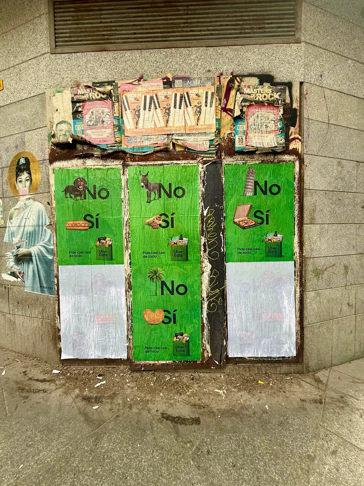

Madrid se recorre andando y, si te fijas, las paredes cuentan cosas. Eso es lo que buscaba Uber Eats cuando nos pidió llevar su mensaje a la calle: que cualquiera que pasara por delante leyera eso de *"pide casi casi de todo"* sin tener que sacar el móvil. Y ahí entramos nosotros.

## Un mensaje pegado a la pared, no en una pantalla

La idea era sencilla. En vez de meter el anuncio en un soporte que la gente ya ignora, lo llevamos donde no se puede saltar: la pared.

En la imagen se ve el trabajo tal y como quedó. Una pared de bloques de piedra gris, con una estructura metálica oxidada incrustada en ella, y los carteles cubriéndola a nivel de calle. Esa mezcla de piedra vieja, hierro y color es justo lo que buscábamos: un anuncio que parece parte del barrio y que no pide permiso para que lo mires.

Con esa premisa montamos la **pegada de carteles**: elegimos el muro, preparamos la superficie y dejamos el mensaje listo para convivir con el día a día de la ciudad.

## Cómo trabajamos una pegada de carteles en Madrid

Antes de pegar nada, hay trabajo detrás. Esto es lo que hacemos siempre:

- Estudio de la pared: miramos el estado del muro, la altura y cómo se ve desde la acera.
- Preparación de la superficie: limpiamos y aseguramos el soporte para que el papel no se despegue con el viento.
- Colocación de los carteles: se pegan alineados y tensos, sin burbujas ni arrugas.
- Repaso posterior: volvemos a pasar para comprobar que todo sigue en su sitio.

El **street marketing** vive de eso, de detalles que no salen en una foto pero se notan cuando vas caminando.

## Por qué funciona para una marca como Uber Eats

Uber Eats no vende algo que se pueda tocar en la calle. Vende la idea de tener casi de todo a un clic. Y esa idea, pegada en una pared de Madrid, se entiende en dos segundos.

Lo que vimos en este tipo de trabajo:

1. Impacto a pie de calle, sin depender de algoritmos.
2. Presencia en zonas donde vive gente, no solo donde pasa.
3. Un formato que aguanta sol, lluvia y miradas.
4. Un coste ajustado frente a otros soportes.

Además, el cartel se hace foto. La gente lo comparte, lo etiqueta y el mensaje sigue circulando cuando ya nos hemos ido. Para una marca de reparto, eso vale doble.

## Lo que nos llevamos de este trabajo

Cada acción deja algo. Aquí nos quedamos con la mezcla: una pared que ya tenía su historia y un mensaje que ahora forma parte de ella. Si tienes una marca y quieres que la vean en la calle de verdad, escríbenos. Sabemos dónde, cómo y con qué pegamento.
