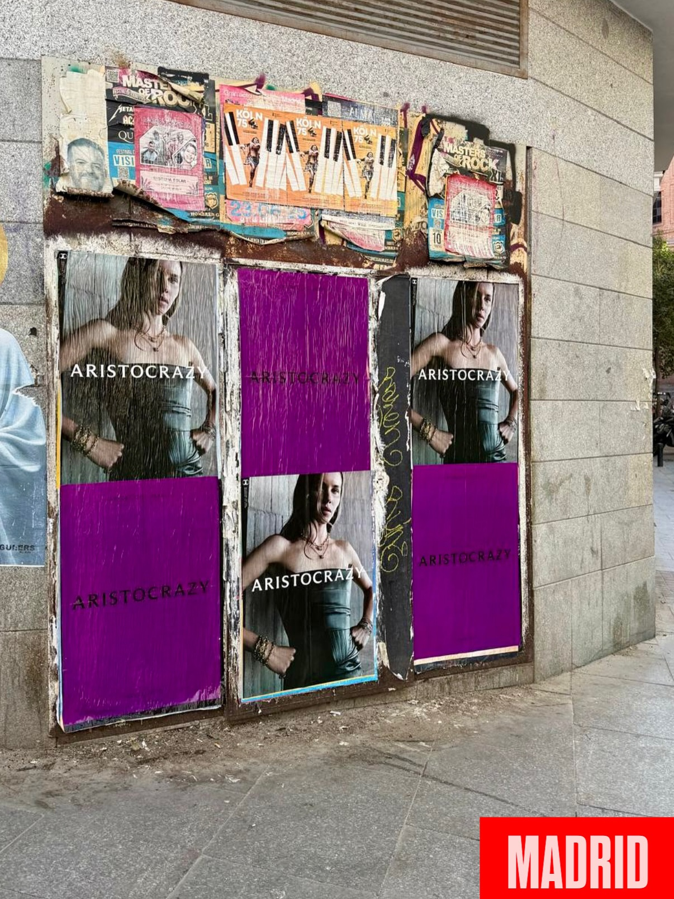

Aristocrazy ha sacado su nuevo morado a la calle. Madrid, Barcelona, Sevilla y Valencia son las cuatro ciudades donde la marca ha presentado ese tono más intenso y más potente, y para llevarlo hasta ahí hemos hecho una **pegada de carteles** sobre soportes urbanos. Los carteles se han pegado en paneles colocados sobre fachadas de piedra, en sitios por donde pasa gente cada día.

## Un color nuevo que pide calle

El morado de Aristocrazy cambia, y lo hace con una idea detrás: *"evolucionar no es cambiar, es avanzar sin perder la esencia"*. Eso es lo que cuenta la marca en su campaña y eso es lo que se ve en el cartel. El nuevo tono es más fuerte que el de antes, así que pedía un soporte a la altura, con carteles a la vista de cualquiera que pase por delante.

Aquí no vale solo imprimir. Cuando el soporte es la fachada de un edificio, el color tiene que aguantar la luz del sol y las inclemencias del tiempo, y el papel tiene que quedar bien pegado, sin arrugas ni burbujas. Un cartel mal puesto se nota enseguida y el trabajo pierde fuerza.

## Cómo montamos una campaña de wild posting

Cada ciudad tiene su ritmo y sus zonas, pero el proceso se parece bastante. Estos son los pasos que seguimos:

- Buscamos soportes en puntos de paso, donde hay movimiento de gente y el cartel se ve de verdad.
- Preparamos la impresión para que el morado salga igual de intenso en todos los soportes.
- Pegamos con cuidado, sin arrugas ni burbujas, para que el acabado quede limpio.
- Repasamos cada punto al terminar y comprobamos que todo está en su sitio.

La pegada de carteles es un trabajo de calle, así que depende del día, del sitio y de la gente que pasa. Por eso conviene hacer un recorrido antes y elegir bien dónde va cada cartel.

## Lo que aporta el street marketing a una marca

El **street marketing** sirve para algo muy simple: que la marca esté donde está la gente, sin que nadie tenga que buscar nada. En el caso de Aristocrazy, el nuevo morado se ha plantado en cuatro ciudades a la vez y ha convertido la calle en el escaparate de la marca.

Además, la calle tiene una cosa buena: la gente comparte lo que ve. Un cartel bien puesto en una fachada llama la atención, alguien le hace una foto y acaba en redes sin que la marca mueva un dedo.

Si tienes una campaña entre manos y quieres que se vea en la calle, en Madrid, Barcelona, Sevilla, Valencia o donde haga falta, escríbenos y lo montamos.
