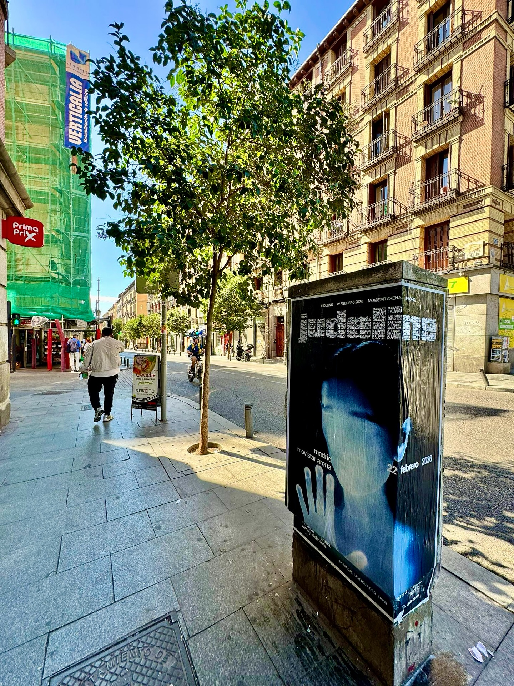

Judeline tiene una de esas voces que no se olvidan. Su gira *"Bodhiria Tour"* pasa por Madrid el domingo 22 de febrero de 2026, con el Movistar Arena como escenario y las entradas ya a la venta en movistararena.es. Para un concierto así, quedarse solo en redes no era una opción: sacamos la campaña a la calle con una **pegada de carteles** pensada para que la fecha se le quedara grabada a quien pasea por la ciudad.

## La calle como escaparate del concierto

Cuando un evento se anuncia con tiempo, el cartel en la vía pública hace un trabajo muy concreto: recuerda la fecha y mete el concierto en la cabeza de quien pasa por delante. En este caso trabajamos con la imagen del *"Bodhiria Tour"* y la llevamos a la acera, a la altura de la mirada, para que el mensaje llegara a la gente que se mueve cada día por la ciudad.

El cartel no compite con nada. Está ahí, a la vista, sin que nadie tenga que buscarlo. Y eso, para una noche como la del Movistar Arena, cuenta.

## Así montamos cada campaña

Cada encargo es distinto, pero el método se repite porque funciona:

1. Miramos la ciudad y elegimos los puntos donde más gente pasa.
2. Preparamos los carteles con la imagen que nos manda el cliente.
3. Colocamos, revisamos y hacemos seguimiento durante toda la campaña.

No hay más misterio. Lo importante es que el cartel esté donde tiene que estar y que se vea bien, tanto de cerca como de lejos.

## Por qué el **street marketing** sigue funcionando

Las pantallas van y vienen, pero la calle sigue siendo un sitio donde la gente mira. Y para un concierto, eso significa varias cosas:

- Llega a quien no está pendiente del móvil.
- Refuerza lo que el artista ya cuenta en sus redes.
- Deja una huella física en la ciudad, con nombre y fecha.

Para la gira *"Bodhiria Tour"* en Madrid, la pegada de carteles fue la forma de llevar el concierto a la rutina de la gente: del anuncio en redes al cartel que te encuentras al salir de casa.

Si tienes un evento, un concierto o un lanzamiento entre manos y quieres que tu ciudad se entere, escríbenos. Nos gusta ver nuestros carteles en la calle casi tanto como a ti verlos llenos.
