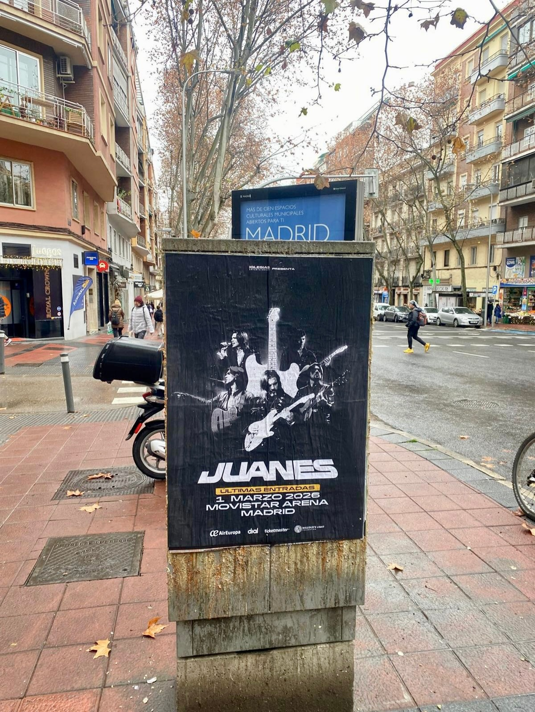

Madrid ya lo tiene apuntado en la agenda: Juanes llega a la ciudad y lo hace con las últimas entradas disponibles. Para que nadie se enterara tarde, montamos una campaña de **pegada de carteles** en plena calle, con el concierto como único protagonista.

## Un cartel que se ve desde la acera

El soporte elegido fue una columna publicitaria en una calle de Madrid. Sobre fondo negro, el cartel muestra a Juanes con la banda y la silueta de una guitarra en blanco, un contraste que se lee de un vistazo mientras la gente pasa caminando, en moto o en bici.

El mensaje no deja lugar a dudas. En el cartel aparece, de arriba abajo: el nombre del promotor, JUANES en grande, la franja de últimas entradas, la fecha del 1 de marzo de 2026, el Movistar Arena y Madrid. Abajo, los logos de AirEuropa, dial y Ticketmaster. Alrededor, la vida normal del barrio: balcones, una parada con información municipal, coches y gente cruzando la calle.

## Por qué funciona una pegada de carteles

Este tipo de soportes siguen funcionando para anunciar conciertos porque van donde está la gente, sin pantallas ni algoritmos por medio. Estas son algunas de sus ventajas:

- Mensaje directo: artista, fecha, recinto y ciudad en un solo golpe de vista.
- Impacto repetido: el cartel está en la calle todos los días, a cualquier hora.
- Cercanía: se coloca en puntos por donde pasa el público que va a conciertos.
- Recuerdo de marca: el nombre del artista y el recinto se quedan grabados.

A eso se suma algo que no se puede medir, pero se nota: el cartel forma parte del paisaje de la ciudad durante la campaña. La gente lo comenta, lo fotografía y lo comparte. Y ahí es donde la **pegada de carteles** se convierte en conversación, no solo en publicidad.

## Street marketing para llenar el Movistar Arena

Una campaña de **street marketing** como esta no se improvisa. Hay que elegir los soportes, preparar el arte final, coordinarlo con el cliente y colocar cada cartel en su sitio para que el resultado se vea limpio. En el caso de Juanes, el objetivo era claro: que cualquiera que pasara por delante supiera que el 1 de marzo de 2026 hay concierto en el Movistar Arena y que quedan las últimas entradas.

Si tienes un evento, un concierto o un lanzamiento y quieres que Madrid se entere, esto es lo que hacemos. Escríbenos y preparamos tu campaña de calle.
