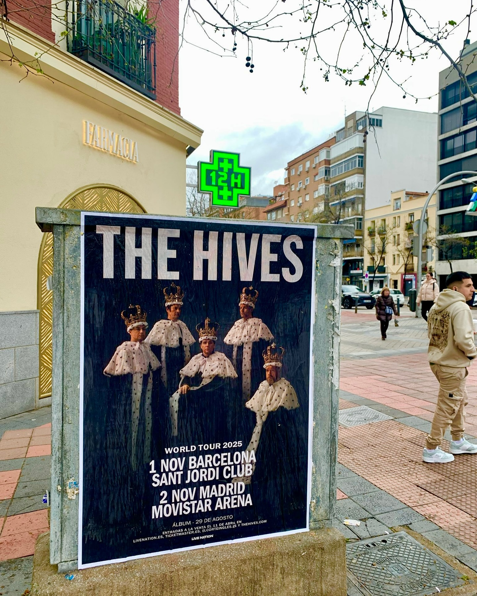

Cuando una banda de rock potente anuncia fechas en nuestro país, la promoción tiene que hacerse notar desde el primer momento. Para dar a conocer las actuaciones confirmadas dentro de su gira *"World Tour 2025"*, hemos realizado una acción de **pegada de carteles** en la calle, logrando que el anuncio del grupo llame la atención de los peatones durante sus recorridos diarios.

La publicidad exterior sigue siendo una herramienta imprescindible para conectar de forma directa con el público. En esta ocasión, la gráfica del cartel —con los integrantes luciendo coronas y capas reales sobre un fondo oscuro— destaca de forma muy clara sobre las estructuras de hormigón y el entorno urbano.

## Impacto visual directo a pie de calle

El objetivo principal de esta campaña de **street marketing** era conseguir una visibilidad inmediata coincidiendo con el lanzamiento de las entradas. Colocar la cartelería en soportes ubicados en zonas de paso peatonal permite que la información llegue de manera natural a miles de personas mientras caminan por la ciudad.

En los carteles fijados en la vía pública se anuncian las fechas oficiales programadas en España:

- 1 de noviembre: Sant Jordi Club en Barcelona.
- 2 de noviembre: Movistar Arena en Madrid.

Además, en la parte inferior de la gráfica se detallan los puntos de venta oficiales como livenation.es, Ticketmaster.es, El Corte Inglés.es y thehives.com, permitiendo que cualquier persona que vea el cartel sepa al instante dónde adquirir sus pases.

## La eficacia del papel en el entorno urbano

Combinar un diseño con personalidad y una correcta colocación en la calle garantiza que el mensaje no pase desapercibido. A diferencia de los anuncios en pantallas o redes sociales, la presencia física en la vía pública acompaña al ciudadano en su rutina diaria y refuerza el recuerdo del evento.

En este trabajo, la pegada de carteles ha servido para transmitir la energía del grupo y anunciar sus próximos shows de forma clara. Si quieres promocionar un concierto, una gira o cualquier tipo de evento con presencia real en las calles, ponte en contacto con nosotros y preparamos tu campaña.
