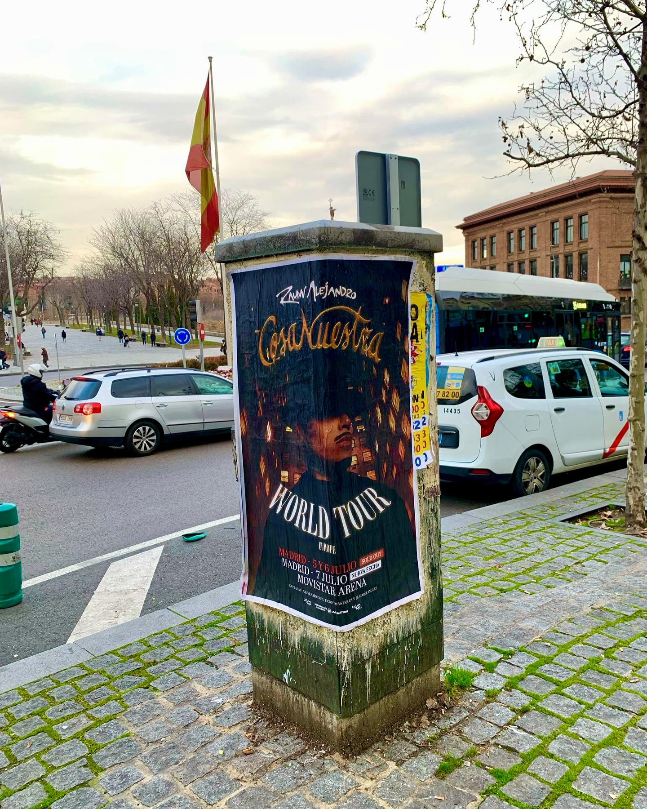

Cuando un artista como Rauw Alejandro anuncia una gira, la ciudad entera se entera. Y para que Madrid y Barcelona supieran que el "Cosa Nuestra World Tour" llegaba con varias fechas, nosotros nos encargamos de que las calles hablaran. Esta fue nuestra pegada de carteles para uno de los lanzamientos más esperados del año.

## La estrategia detrás de la pegada de carteles

Nuestro equipo sabe que el **street marketing** funciona mejor cuando el mensaje aparece donde la gente menos lo espera. Por eso, para esta campaña, nos centramos en puntos de mucho paso en las dos ciudades. No hicimos falta inventar nada: el cartel hablaba por sí solo, con las fechas marcadas bien grandes y el nombre de la gira ocupando todo el protagonismo.

La **pegada de carteles** no es solo pegar papel. Es elegir la pared adecuada, el momento perfecto y la esquina exacta para que el póster se convierta en parte del paisaje urbano. En este caso, el diseño del cartel era tan llamativo que no necesitaba más que un vistazo para que alguien se parara a leerlo.

## Una gira que lo petó en Madrid y Barcelona

El tour tenía unas fechas que ya estaban agotadas antes de que acabáramos de pegar los carteles:

- 5 de julio en el Movistar Arena de Madrid: SOLD OUT
- 6 de julio en el Movistar Arena de Madrid: SOLD OUT
- 7 de julio en el Movistar Arena de Madrid: NUEVA FECHA
- 11 de julio en el Palau Sant Jordi de Barcelona: SOLD OUT
- 12 de julio en el Palau Sant Jordi de Barcelona: NUEVA FECHA

Cuando anunciamos las nuevas fechas, el revuelo fue inmediato. La gente empezó a buscar entradas en Live Nation, Ticketmaster y El Corte Inglés, y nosotros seguíamos viendo nuestros carteles en cada esquina. Esa es la magia del street marketing: no hace falta que nadie te lo cuente, lo ves con tus propios ojos.

## Por qué las marcas confían en nosotros

Trabajar con una gira de este nivel implica coordinación, rapidez y mucha calle. Nosotros ya hemos hecho esto antes, y sabemos que cada campaña tiene su ritmo. Para Rauw Alejandro, el objetivo era claro: que nadie se quedara sin saber que las entradas estaban a punto de volar. Y vaya si lo consiguieron.

Si tienes un evento, un lanzamiento o una gira y quieres que la ciudad hable de ti, nosotros somos el equipo que necesitas. La pegada de carteles sigue siendo una de las formas más directas de conectar con la gente, y nosotros la dominamos.

¿Hablamos?
