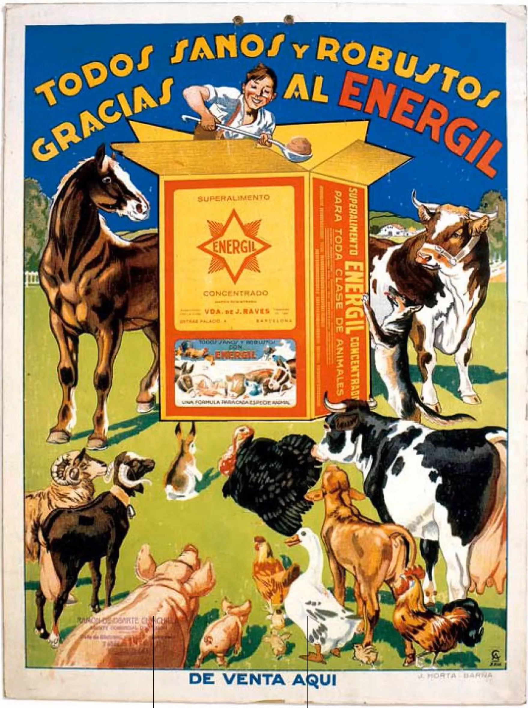

## Dos inícios artesanais à profissionalização

O costume de afixar cartazes em Madrid remonta ao início do século XX, quando a cidade começava a sua transformação numa grande urbe. Naquela época, Madrid contava com pouco mais de 500.000 habitantes e estava imersa num processo de crescimento e industrialização. No entanto, as possibilidades de comunicação massiva eram ainda limitadas, pois nem a rádio nem a televisão se tinham popularizado ainda.

Foi então que a [afixação de cartazes em Madrid](/) de forma manual se consolidou como uma das formas mais eficazes para promover os diversos eventos culturais, desde peças de teatro e concertos até lutas de galos e touradas. Os primeiros cartazes costumavam ser anúncios manuscritos ou impressos de maneira artesanal em papel. Voluntários encarregavam-se de os colar à mão nos candeeiros, esquinas e muros da cidade para dar a conhecer as atividades entre os vizinhos madrilenos.

Com o passar dos anos, a tradição foi-se profissionalizando. À medida que a urbe crescia em tamanho e importância, surgiram as primeiras gráficas que se dedicavam à elaboração de cartazes de forma semindustrial. Os designs ganharam em qualidade e complexidade graças às novas técnicas de impressão. No entanto, manteve-se o espírito artesanal das origens, com grupos de pessoas a distribuir os cartazes à mão por toda a geografia madrilena.

## A consolidação de um sinal de identidade

Ao longo do século XX, a afixação de cartazes foi-se consolidando como um autêntico sinal de identidade da capital de Espanha. À medida que Madrid se convertia numa grande metrópole, o costume de anunciar eventos culturais através destes anúncios de rua estendeu-se por todos os bairros.

Os candeeiros, esquinas e muros da cidade enchiam-se de cartazes dos mais variados designs e cores, anunciando desde peças de teatro até concertos de música moderna. Cada cartaz era um pequeno pedaço de história que permanecia durante semanas no mobiliário urbano, deixando registo da intensa vida cultural da cidade.

A evolução dos suportes e designs foi paralela ao desenvolvimento tecnológico das décadas seguintes. Da serigrafia passou-se à impressão offset e, mais tarde, às primeiras impressões digitais a cores. Os cartazes deixavam de ser simples anúncios manuscritos para se tornarem autênticas obras de arte urbana. No entanto, a essência manteve-se: promover a cultura madrilena através de anúncios de rua.

## Normativas para regular a colocação de cartazes

Apesar de ser uma tradição muito enraizada entre promotores culturais e coletivos, nem toda a gente via a afixação de cartazes com bons olhos. Alguns vizinhos e associações consideravam-na um elemento que sujava a estética das ruas e fachadas da cidade.

Também havia queixas pelo excesso de cartazes empilhados em algumas zonas, o que dava origem a um aspeto desordenado. Por este motivo, no final do século XX a Câmara Municipal de Madrid começou a estabelecer uma série de normativas para regular a sua afixação. Foram fixados limites quanto a tamanhos, suportes permitidos e prazos de retirada.

Do mesmo modo, foram estabelecidas sanções para aqueles que incumprissem os regulamentos municipais. O objetivo era preservar a tradição sem que afetasse negativamente a imagem da capital. Mesmo assim, o costume manteve-se muito enraizado entre os coletivos culturais.

## Mais do que uma função promocional

Apesar da sua função promocional, com o passar do tempo os cartazes de rua de Madrid acabaram por se tornar algo mais do que simples anúncios. Transformaram-se em autênticas amostras do pulso cultural da cidade, refletindo através dos seus designs e mensagens as tendências artísticas de cada época.

Cada cartaz passava a fazer parte, embora de forma efémera, da paisagem urbana madrilena. Constituíam uma forma de conhecer de relance que espetáculos se representavam em cada momento, desde os clássicos do Siglo de Oro até às vanguardas artísticas. Mesmo quando desapareciam, tinham deixado a sua marca como testemunhas da história recente da capital.

## A afixação de cartazes madrilena hoje em dia

Apesar do aparecimento de novos canais de comunicação digitais, a tradição dos cartazes de rua permanece em Madrid. Mais de um século depois dos seus inícios, continua a cumprir a sua função de promover a intensa vida cultural da cidade. É por isso que promotores culturais e associações continuam a apostar nesta ferramenta, que alia eficácia e baixo custo.

Embora a normativa municipal tenha profissionalizado a sua afixação, também foi flexibilizada para permitir a sua utilização a coletivos sem fins lucrativos. Apesar das críticas de alguns, os cartazes de rua fazem parte do acervo cultural e identitário de Madrid. Uma tradição que, mais de um século depois dos seus inícios, perdura graças à sua capacidade para promover a cultura na rua.
