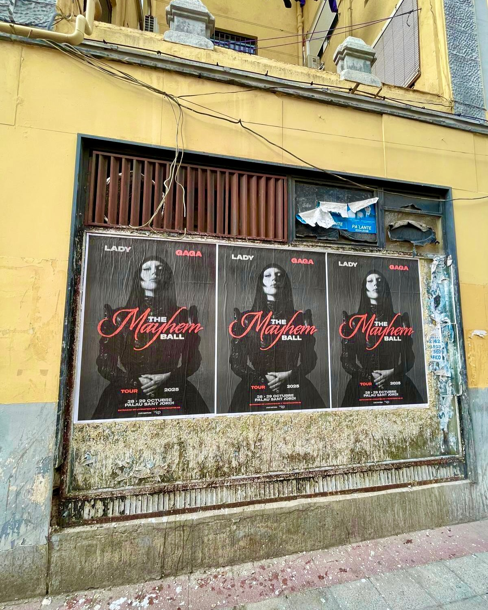

Lady Gaga regressa a Barcelona e fá-lo com a sua digressão *«The Mayhem Ball Tour»*. O Palau Sant Jordi será o palco nos dias 28 e 29 de outubro, e nós quisemos fazer parte da festa com uma **colagem de cartazes** que invadiu a cidade. Contamos-lhe tudo.

## Uma digressão que promete ser histórica

O anúncio dos concertos revolucionou os fãs. Os bilhetes estarão disponíveis em pré-venda de 31 de março a 2 de abril em livenation.es e ticketmaster.es. Com tamanha expectativa, a promoção na rua era fundamental. A nossa equipa deitou mãos à obra para que ninguém perdesse o encontro.

## Assim foi a nossa colagem de cartazes

O **street marketing** tem uma força que o digital não consegue igualar, e esta campanha é um exemplo perfeito. Encarregámo-nos de todo o processo:

- Design e produção dos cartazes, com a imagem que vê na fotografia.
- Seleção dos pontos mais visíveis de Barcelona para colocar a publicidade.
- Colagem de cartazes em superfícies aptas, garantindo a máxima exposição.
- Documentação gráfica del resultado, como se pode ver na imagem que partilhamos.

Cada cartaz tornou-se num pequeno altifalante do evento. A combinação de cores e a tipografia de *«The Mayhem Ball Tour»* fizeram o resto: era impossível não olhar para eles.

## O impacto da publicidade exterior

Quando uma cidade inteira fala de um concerto, as ruas têm de acompanhar. A colagem de cartazes que realizámos para Lady Gaga em Barcelona demonstra que o papel continua a ser um meio incrivelmente eficaz. Não só gera expectativa, como também transforma a paisagem urbana em parte do espetáculo.

Se quer que o seu próximo evento soe tão forte como *«The Mayhem Ball Tour»*, já sabe como trabalhamos. Uma colagem de cartazes bem feita pode fazer a diferença.
