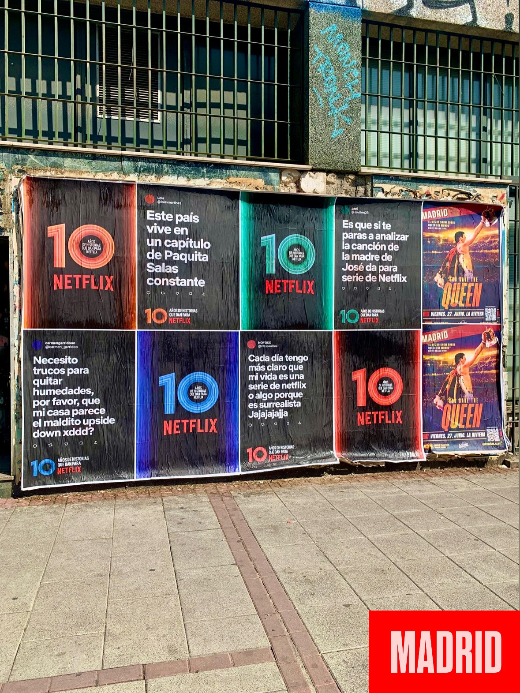

Quando uma plataforma passa dez anos a contar histórias, não basta celebrá-lo apenas no digital. É preciso sair para a rua, sujar as mãos e colar cartazes. Por isso, para o 10.º aniversário de Netflix España, organizámos uma **colagem de cartazes** em várias cidades. O objetivo: que os transeuntes se deparassem com uma história em cada esquina. E fizemo-lo em Madrid, Barcelona, Valencia e Málaga.

Este tipo de **street marketing** tem uma vantagem clara: não se pode ignorar. Um cartaz bem colocado numa parede interpela-te. Não há algoritmo que o evite. Por isso, para uma marca que vive de histórias, a rua é a melhor montra.

## Dez anos de histórias que dão para Netflix

O lema da campanha dizia tudo: cada história merece ser contada. E para as contar, nada melhor do que ocupar o espaço público. Nesta ação, os cartazes transformaram-se em pequenas portas visuais espalhadas pelo mobiliário urbano. A imagem que captámos mostra uma parede ao nível da rua com vários cartazes bem visíveis, mesmo onde as pessoas passam todos os dias.

As cidades escolhidas foram:

- Madrid
- Barcelona
- Valencia
- Málaga

Quatro pontos-chave em que a marca se fez presente com uma colagem de cartazes que não passou despercebida.

## Como se faz uma colagem de cartazes profissional

Uma colagem de cartazes não é simplesmente empapelar uma parede. Por trás há um processo: escolher os suportes adequados, preparar a superfície, usar o tipo de cola correto e colocar cada cartaz para que aguente o passar dos dias. Nesta campanha, a equipa organizou-se para cobrir vários pontos de cada cidade sem perder o ritmo. O resultado vê-se na foto: uma parede que chama a atenção e que faz parte da paisagem urbana.

Além disso, a colagem de cartazes permite chegar a zonas onde outros formatos não entram. Um muro numa rua movimentada vale mais do que mil banners. E essa é a graça do wild posting: não parece publicidade, parece parte da cidade. Até te parares para ler, claro.

## Por que o wild posting continua a funcionar

O wild posting tem algo que a publicidade digital não consegue copiar: a surpresa. Quando encontras um cartaz bem colado numa parede, não podes fazer scroll para o saltar. Está ali, à tua altura, e obriga-te a olhar para ele. Para uma marca como Netflix, que vive de histórias, este formato é perfeito. Porque cada cartaz é uma porta para uma história, e cada história merece ser contada.

Num momento em que tudo acontece em ecrãs, sair para a rua é um ato quase revolucionário. E quando o fazes bem, as pessoas agradecem. Essa é a intenção desta campanha: que cada cartaz convide a parar um segundo. Porque cada história merece ser contada.

Se tens uma marca, um evento ou uma história para contar, a rua continua a ser uma tela enorme. E nós sabemos como preenchê-la.
