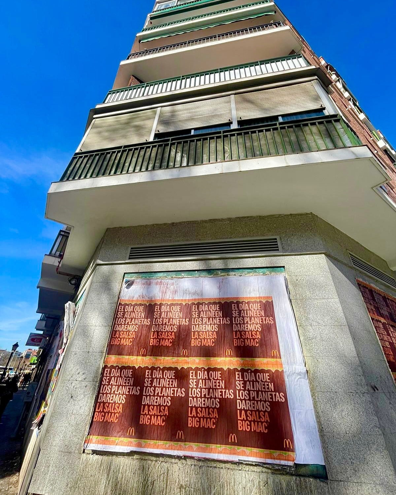

Quando uma marca como o McDonald's decide lançar um produto limitado, a rua é o melhor cenário. E se falamos do molho Big Mac, a expetativa é máxima. Nós sabíamos disso, por isso pusemos mãos à obra com uma **afixação de cartazes** que não deixasse ninguém indiferente.

## Uma campanha que brinca com o alinhamento planetário

No dia 28 de fevereiro, segundo o anúncio do McDonald's, os planetas alinham-se. Nesse dia, a marca vai disponibilizar 467 unidades do seu preciado molho Big Mac através da aplicação MyMcDonald's. Não é um lançamento qualquer: é um evento. E o nosso trabalho era que as pessoas o soubessem antes de abrir a app.

Para isso, nada melhor do que o **street marketing**. Saímos para a rua com uma mensagem clara, direta e em maiúsculas, como a que se vê na imagem: um cartaz de grande formato colado na esquina de um edifício, com o texto repetido em várias filas e colunas. Assim, de longe, já se percebe que algo importante está prestes a acontecer.

## Assim executámos a afixação de cartazes

A afixação de cartazes é uma das técnicas mais eficazes do marketing exterior. Consiste em escolher pontos estratégicos da cidade e cobri-los com cartazes de papel que chamam a atenção do peão. Neste caso, o cartaz tinha de transmitir a urgência de conseguir uma das 467 unidades.

Isto é o que fizemos, passo a passo:

- Localizámos uma esquina com boa visibilidade, como a da foto, onde o cartaz se vê de várias direções.
- Preparámos o papel com o design da campanha, com o texto repetido para criar um efeito visual chamativo.
- Aplicámos o adesivo na parede e colámos o cartaz com precisão, evitando bolhas e rugas.
- Verificámos que o cartaz ficava bem fixado e que a mensagem se lia sem obstáculos.

O resultado é um impacto visual que não passa despercebido. Quem passa à frente, levanta o olhar e apercebe-se de que no dia 28 de fevereiro há uma oportunidade única de conseguir o molho Big Mac.

## Porque é que o street marketing funciona para este tipo de lançamentos

Quando um produto é tão limitado, a chave está em gerar desejo. E o desejo nasce na rua, ao ver o cartaz, comentando-o com os amigos, tirando uma foto. A afixação de cartazes converte uma simples promoção num tema de conversa.

Além disso, é uma opção muito flexível: pode ser feita numa só esquina ou em várias, consoante o orçamento e o alcance que se queira conseguir. Neste caso, o cartaz da imagem demonstra que às vezes não é preciso muito para chamar a atenção. Apenas uma boa mensagem, um bom sítio e uma execução impecável.

Se tens um produto que queres lançar ou uma promoção que precisa de ruído, o street marketing é o teu aliado. Nós tratamos de que a tua mensagem chegue ao nível da rua, com a mesma energia que colocamos em cada projeto. Falamos? A tua próxima campanha pode ser a próxima a encher as ruas de cartazes.
