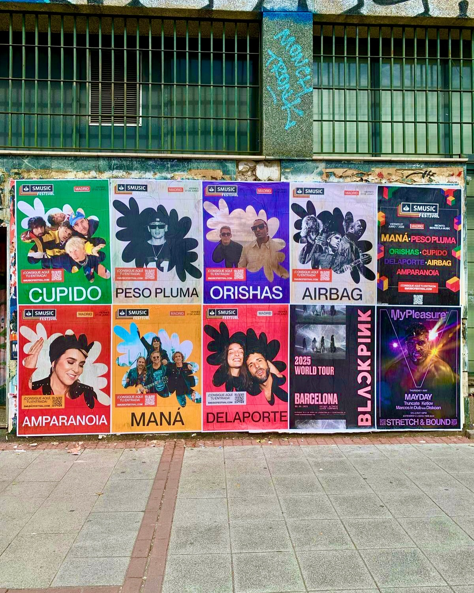

Madrid é uma cidade que não para e a música ao vivo faz parte do seu dia a dia. Ainda há pouco tempo nos encarregámos de dar visibilidade na rua ao *"SMUSIC FESTIVAL"*, um evento que celebra a sua primeira edição na próxima sexta-feira, 27 de junho, no Recinto Iberdrola Music. Para conseguir que a notícia chegasse a milhares de pessoas, realizámos uma campanha de **colagem de cartazes** pensada para captar a atenção dos amantes da música em espanhol.

## Um impacto visual direto para o *"SMUSIC FESTIVAL"* em Madrid

Quando se promove um evento musical desta magnitude, a presença na via pública é um pilar fundamental. Através de ações de **street marketing**, conseguimos que os nomes dos artistas se destaquem em superfícies urbanas e zonas de passagem. A campanha combinou um design colorido e muito visual com uma distribuição em murais onde as tipografias grandes tornavam impossível não reparar.

Nesta ocasião, o grafismo do festival destacava grandes nomes da música:
- Maná e Peso Pluma na parte alta da proposta musical.
- Orishas, Cupido e Delaporte a trazer variedade de géneros.
- Airbag e Amparanoia a completar um cartaz cheio de energia.

## Cartazes individuais e códigos QR para conectar com o público

Para esta ação não utilizámos um único modelo de grafismo. A parede vestiu-se com uma composição tipo grelha que combinaba cartazes individuais dedicados a cada artista (com designs próprios para Cupido, Delaporte, Amparanoia ou Peso Pluma) juntamente com um cartaz geral com toda a informação do evento.

Além disso, cada cartaz trazia integrado um código QR claro com a mensagem *"Garante aqui a tua entrada!"*, que redirecionava diretamente para o site smusicfestival.com. Desta forma, a clássica colagem de cartazes funciona também como uma ponte digital, permitindo às pessoas comprar a sua entrada no mesmo momento em que veem a publicidade enquanto caminham pela rua.

Se precisas de dar a conhecer um festival, concerto ou qualquer projeto cultural com presença real nas ruas, entra em contacto connosco e ajudamos-te a levar a tua campanha para a via pública.