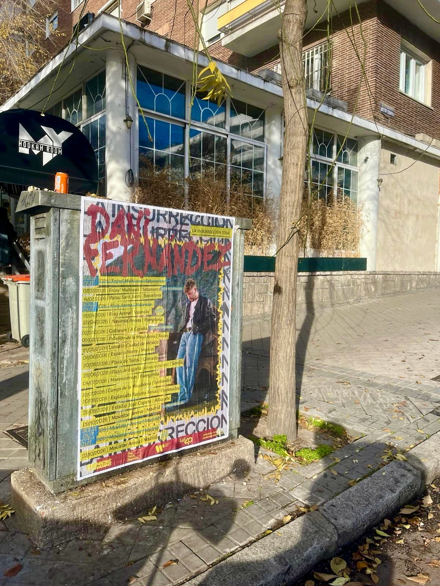

Dani Fernández sai em digressão com *"La Insurrección Tour 2026"* e há datas que se preparam desde a rua. Para anunciar o calendário de concertos em Espanha e no México pusemos em marcha uma campanha de **colagem de cartazes** em suportes urbanos: o cartaz da digressão colado em plena via pública, com a lista de datas à vista de qualquer pessoa que passasse à frente.

## Uma digressão com paragens confirmadas

O cartaz reúne o percurso completo da digressão e algumas das datas já estão fechadas no calendário:

- 14/03 – Palau Sant Jordi, Barcelona
- 21/05 – Lunario, CDMX
- Movistar Arena, Madrid, com quatro noites únicas
- E muitas mais cidades por anunciar

Com esse volume de datas, o desafio estava claro: que o público soubesse que a digressão chega perto de casa e que os bilhetes estão à venda.

## Um cartaz pensado para a rua

O design joga com o nome do artista a vermelho sobre fundo claro, o selo de *"La Insurrección Tour 2026"* e uma lista de cidades e recintos que ocupa boa parte do papel. É um formato que se lê num relance e que aguenta bem as intempéries, algo fundamental quando o suporte é mobiliário urbano e o cartaz é colado junto à calçada, onde há tráfego de pessoas a qualquer hora.

A colagem foi feita com o cuidado de sempre: superfície limpa, papel bem esticado e sem bolhas, e revisão posterior para verificar que tudo continua no seu lugar. Um cartaz amarrotado ou descolado transmite o contrário do que procura uma digressão: vontade de ir.

## Porque é que o wild posting encaixa numa digressão

O **street marketing** funciona aqui por vários motivos:

1. Impacto no dia a dia: as pessoas veem-no a caminho do trabalho, do bar ou de casa.
2. Repetição: o mesmo cartaz em diferentes pontos da cidade reforça a mensagem.
3. Proximidade: chega a quem não segue o artista nas redes sociais.
4. Sem filtros: não depende do algoritmo nem de um anúncio que se pode saltar.

Além disso, é uma fórmula que se adapta a qualquer orçamento e a qualquer fase da campanha: desde o anúncio inicial até ao empurrão final antes do concerto. Para uma digressão com paragens em Barcelona, Madrid, Cidade do México e muitas mais cidades, ter presença na rua soma quando o público decide comprar o bilhete.

Se tens uma digressão, um festival ou um evento e queres que se veja na rua, a colagem de cartazes continua a ser uma das formas mais diretas de chegar ao teu público.

